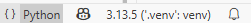
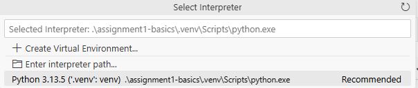

# Language Modeling from Scratch

This repo contains my assignment attempts and notes from **Stanford's CS336: Language Modeling from Scratch**.

- Course lectures playlist: https://www.youtube.com/playlist?list=PLoROMvodv4rOY23Y0BoGoBGgQ1zmU_MT_
- Course website (schedule, assignments, slides, etc.): https://stanford-cs336.github.io/spring2025/

Each assignment's folder was created by manually copying from the corresponding official repo of the assignment.
I'm not using submodules. This means if fixes are made to the official repo and I want to pull them,
I'd have to copy them over manually. Here's a [sample commit](https://github.com/habbes/stanford-cs336-llm-from-scratch/commit/19438a8471ff555cca99edaa7170d42883a10e14)
where I copied over latest changes from the official repo. When doing so, be careful
not to overwrite your own changes that you want to preserve, since some updates make
changes to files you've modified (e.g. the adapters module).

- Assignment 1:
  - [Local folder](./assignment1-basics/)
  - [Official repository](https://github.com/stanford-cs336/assignment1-basics)

Use [uv](https://docs.astral.sh/uv/) to create a python environemtn for each project (see each project's `README.md`).

To run python script, activate the project's environment in the terminal using:

```sh
# On Powershell/Windows
.\.venv\Scripts\activate

# On macOs/Linux
source .venv/bin/activate
```

Use the environment's python interpreter in VS Code to get better intellisense support.



