# 3. Transformed Language Model Architecture

Related papers:

- [Improving Language Understanding by Generative Pretraing, Radford et al 2018](https://cdn.openai.com/research-covers/language-unsupervised/language_understanding_paper.pdf)

This is the architecture we're going to implement (this differs from the original Transformer paper. Various sections will explain how and why we deviate from the original)

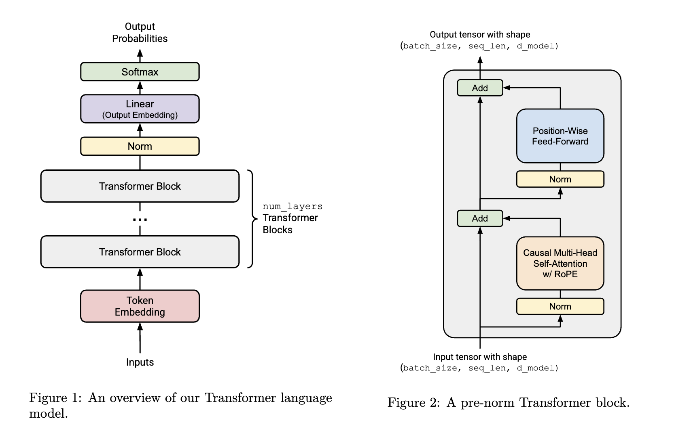


## 3.2 Remark: Batching, Einsum and Efficient Computation

Einsum notation, inspired by Einstein sums, is a more readable and ergonomic way of working tensor dimensions.
It provides more intuitive syntax of operations like rearranging dimensions, transposition, broadcast operations, etc.

The instructions recommend that students new to einsum notation use the [**`einops`**](https://einops.rocks/) package and that those
that are familiar to use the [**`einx`**](https://einx.readthedocs.io/en/latest/). Since
this is my first time hearing of this, I'm going to use **einops**:

- [einops tutorials](https://einops.rocks/1-einops-basics/)
- [einops repository](https://github.com/arogozhnikov/einops)
- [einops in 30 seconds](https://medium.com/@kyeg/einops-in-30-seconds-377a5f4d641a)

I've created a repo to learn and experiment with einops: https://github.com/habbes/learn-einops

Reiterating the instructions in the assignment overview, this is the policy of the course on what abstractions
can be used. I want to abide by it as well:

> We expect you to build these components from scratch. In particular, you may notuse any definitions from `torch.nn`, `torch.nn.functional`, or `torch.optim` except for the following:
>
> - `torch.nn.Parameter`
> - [Container classes](https://pytorch.org/docs/stable/nn.html#containers) in `torch.nn` (e.g., `Module`, `ModuleList`, `Sequential`, etc.)
> - The `torch.optim.Optimizer` base class
>
> You may use any other PyTorch definitions. When in doubt, consider if using it compromises the“from-scratch” ethos of the assignment

Speaking of PyTorch, I also needed a refresher. I took a break to go through some tutorials here: https://github.com/habbes/learn-pytorch

### Notes on mathematical notation memory-ordering

> Many machine learning papers use row vectors in their notation, which result in representations that mesh well with the row-major memory ordering used by default in NumPy and PyTorch. 
> With row vectors, a linear transformation looks like `y=xW.⊤`,
> for row-major W of shape `(d_out, d_in)` and row-vector x of shape `(1, d_in)`.
>
> In linear algebra it’s generally more common to use column vectors, where linear transformations look like `y=W x`,
> given a row-major W  of shape `(d_out, d_in)` and column-vector x of shape `(d_in,)`.
> We will use **column vectors** for mathematical notation in this assignment, as it is generally easier to follow the math this way.
> You should keep in mind that if you want to use plain matrix multiplication notation, you will have to apply matrices using the row vector convention, since PyTorch uses row-major memory ordering.
> If you use einsum for your matrix operations, this should be a non-issue.

*Note*: I'm using a shape to define the matrix set for convenience, instead of the standard mathematical notation of R with the shape as subscript.

To make this more concrete, let's go through an example.

Let's say we have a 3x2 matrix `w` representing the weights of the linear transformation:

```
[
   2 1
   4 3
   5 0
]
```

And 1x2 vector `x` representing the input object. We can consider this as a single object with 2 features:

```
[5 2]
```

Let's encode this in PyTorch with `W` as tensor with shape (3,2) and `x` as tensor with shape (1, 2):

```python
>>> W = torch.tensor([[2, 1], [4, 3], [5,0]])    
>>> W.shape
torch.Size([3, 2])
>>> W
tensor([[2, 1],
        [4, 3],
        [5, 0]])
>>> x = torch.tensor([[5, 2]])
>>> x.shape
torch.Size([1, 2])
>>> x
tensor([[5, 2]])
```

The 2 columns of the W matrix match the 2 features of the input object vectors. And the 3 rows of the matrix W
mean we desire 3 output features per output object. That's why we can think of the dimensions as x -> (1, d_in)
and W -> (d_out, d_in)

If we want to compute the linear transformation y = Wx, then we should treat x as a column vector with shape (2, 1)
so that the dimensions align properly. In PyTorch, that would be `W @ x.T`

```python
>>> x.T   
tensor([[5],
        [2]])
>>> W @ x.T
tensor([[12],
        [26],
        [25]])
```

The result is the 3x1 column vector:

```
[
  12
  26
  25
]
```

However, sticking to the original row vector, and row-major memory ordering, we can perform the "equivalent"
transformation using `x @ W.T` where we transpose W into a 2x3 matrix, but keep x as a 1x2 row vector:

```python
W.T
tensor([[2, 4, 5],
        [1, 3, 0]])
>>> x @ W.T
tensor([[12, 26, 25]])
```

The result is the 1x3 row vector:

[
   12 26 25
]

Note that this is the same result as the previous one, but transposed, i.e. `x @ W.T == (W @ x.T).T`

We can achieve the row-major result using `einsum` without explicit transpose:

```python
>>> einsum(x, W, "batch_size d_in, d_out d_in -> batch_size d_out")
tensor([[12, 26, 25]])
```

We also achieve them same result if we swap the order of the tensors. It's cool
that this just works with `einsum` without explict transposes even though matmul
is not commutative (not sure if there's any difference in the low-level order of operations or efficiency):

```python
>>> einsum(W,x, "d_out d_in, num_objects d_in -> num_objects d_out")            
tensor([[12, 26, 25]])
```

If we wanted to get a column vector as result, we can just swap the output dimensions of the `einsum`:

```python
einsum(x, W, "batch_size d_in, d_out d_in -> d_out batch_size")
tensor([[12],
        [26],
        [25]])
```

We'll use the row major approach in computations as it's more common in deep learning. But more importantly,
it keeps the batch size (and other dimensions that should not be summed over) in the leading dimensions
with preserves batch semantics, and most pytorch nn operations expect the batch size as the leading dimension.
The row major form is also aligned with PyTorch's default memory order, deep learning kernels, etc. SIMD/CUDA, etc.

## 3.3 Basic Building Blocks: Linear and Embedding modules

### 3.3.1 Parameter initialization

> Training neural networks effectively often requires careful initialization of the model parameters—bad initial-izations can lead to undesirable behavior such as vanishing or exploding gradients.
> Pre-norm transformers are unusually robust to initializations, but they can still have a siginificant impact on training speed and convergence.
> Since this assignment is already long, we will save the details for assignment 3, and instead give you some approximate initializations that should work well for most cases. For now, use:

- Linear Weights: `NormalDistribution(mean = 0, variance = 2 / (d_in + d_out))` truncated at [-3stddev, 3stddev]
- Embedding: `NormalDistribution(mean = 0, variance = 1)` truncated at [-3, 3]
- RMSNorm: 1

You should use `torch.nn.init.trunc_normal_` to initialize the truncated normal weights

### 3.3.2 Linear Module

In this part, I implement a linear module based on `nn.Module` to compute y = Wx, to mirror the standard [`nn.Linear`](https://docs.pytorch.org/docs/stable/generated/torch.nn.modules.linear.Linear.html).

*Note*: Note that we do not include a bias term (i.e. b is conceptually 0 in y = Wx + b), following most modern LLMs.

> Make sure to:
>
> - subclass `nn.Module`
> - call the superclass constructor
> - construct and store your parameter as W (not W.T) for memory ordering reasons, putting it in an `nn.Parameter`
> - of course,don’t use `nn.Linear` or `nn.functional.linear`

Storing our weights as `W` instead of `W.T` essentially means using a tensor of shape `(d_out, d_in)` to store the matrix.

I've implemented the custom `Linear` module in the [`nn_modules.py`](./nn_modules.py) file.

To test this, first I update the `run_linear` function in [`../tests/adapters.py`](../tests/adapters.py) to call
initialize and call my custom `Linear` class.

Then run test as:

```sh
uv run pytest -k test_linear
```

```sh
uv run pytest -k test_linear     
======================================================================== test session starts ========================================================================
platform darwin -- Python 3.11.12, pytest-8.4.1, pluggy-1.6.0
rootdir: /Users/habbes/code/learn/stanford-cs336-llm-from-scratch/assignment1-basics
configfile: pyproject.toml
plugins: jaxtyping-0.3.2
collected 48 items / 47 deselected / 1 selected                                                                                                                     

tests/test_model.py::test_linear PASSED

================================================================= 1 passed, 47 deselected in 0.84s ==================================================================
```

Got an error running the test on Windows though:

```sh
====================================================================================================================== ERRORS ======================================================================================================================
___________________________________________________________________________________________ ERROR collecting assignment1-basics/tests/test_tokenizer.py ____________________________________________________________________________________________ 
ImportError while importing test module 'C:\Users\clhabins\source\repos\learn\stanford-cs336-llm-from-scratch\assignment1-basics\tests\test_tokenizer.py'.
Hint: make sure your test modules/packages have valid Python names.
Traceback:
..\..\..\..\AppData\Roaming\uv\python\cpython-3.11.13-windows-x86_64-none\Lib\importlib\__init__.py:126: in import_module
    return _bootstrap._gcd_import(name[level:], package, level)
           ^^^^^^^^^^^^^^^^^^^^^^^^^^^^^^^^^^^^^^^^^^^^^^^^^^^^
assignment1-basics\tests\test_tokenizer.py:5: in <module>
    import resource
E   ModuleNotFoundError: No module named 'resource'
================================================================================================================= warnings summary ================================================================================================================= 
assignment1-basics\tests\adapters.py:294
  C:\Users\clhabins\source\repos\learn\stanford-cs336-llm-from-scratch\assignment1-basics\tests\adapters.py:294: DeprecationWarning: invalid escape sequence '\T'
    """Given the weights of a Transformer language model and input indices,

-- Docs: https://docs.pytest.org/en/stable/how-to/capture-warnings.html
============================================================================================================= short test summary info ============================================================================================================== 
ERROR assignment1-basics/tests/test_tokenizer.py
!!!!!!!!!!!!!!!!!!!!!!!!!!!!!!!!!!!!!!!!!!!!!!!!!!!!!!!!!!!!!!!!!!!!!!!!!!!!!!!!!!!!!!!!!!!!!!!!!!!!!! Interrupted: 1 error during collection !!!!!!!!!!!!!!!!!!!!!!!!!!!!!!!!!!!!!!!!!!!!!!!!!!!!!!!!!!!!!!!!!!!!!!!!!!!!!!!!!!!!!!!!!!!!!!!!!!!!!!
```

Note that while the test passes (at least on *nix systems), it loads weights provided by the tests and not the model's
randomly initialized weights. So it doesn't test whether initialization logic is correctly implemented. I did stumble
on a bug in my initialization code when randomly looking at the code, so I want to write a test for that as well.

I'll basically create a new instance of the module and check that the weights are within the desired bounds and that
the mean and std/variance are close enough to what we expect, i.e.:

```python
>>> d_in, d_out = 1000, 500
>>> l = Linear(d_in, d_out)
>>> target_std = math.sqrt(2/(d_in + d_out))
>>> target_std
0.03651483716701107
>>> l.weights.std()
tensor(0.0360, grad_fn=<StdBackward0>)
>>> l.weights.mean()
tensor(-8.9683e-06, grad_fn=<MeanBackward0>)
>>> target_min, target_max = -3 * target_std, 3 * target_std
>>> target_min, target_max
(-0.10954451150103323, 0.10954451150103323)
>>> l.weights.min(), l.weights.max()
(tensor(-0.1095, grad_fn=<MinBackward1>), tensor(0.1095, grad_fn=<MaxBackward1>))
```
The values seem to be within reasonable bounds of the expected constraints.

I've created a test for this in the [`playground.py`](./playground.py) file under the `test_linear_module_initialization()`
function:

```sh
uv run -m cs336_basics.playground
```

```sh
...
SCENARIO: Verify Linear module weights are initialized with expected distribution
Test passed!
```

### 3.3.3 Embedding module

The embedding layer maps integer token IDs into a vector space of dimension `d_model`, where `d_model` conceptually represents the number of features that represent a token i.e.
An embedding vector will be learned for each unique token id. The embedding module will hold these embedding vectors into a tensor of size `(vocab_size, d_model)` where
`vocab_size` is the number of unique token IDs in our vocabulary.

The input to the embedding module is a batched sequence of tokens, i.e. each item in a batch is a sequence of token ids, hence the input tensor has shape `(batch_size, sequence_length)`.
The sequence length is basically the context window, how many tokens do we have to look back to in order to predict the next token.

Given this input, the embedding module returns the corresponding embedding vector for each input token. I.e., for each input token in each token sequence in the batch, index into
the embedding matrix and return te corresponding embedding vector. Hence the output of the embedding module will be a tensor of shape `(batch_size, sequence_length, d_model)`.

For example, let's say we have a vocabulary of size 3 with token Ids: `vocab = [0, 1, 2]`. Let `d_model = 2`, and we have the following embedding matrix:

```python
[
   [0.1, 0.5],
   [0.24, -1.45],
   [0.51, -2.3]
]
```

This means we have the following token ID to embedding vector mapping:

- 0 -> [0.1, 0.5]
- 1 -> [0.24, -1.45]
- 2 -> [0.51, -2.3]

Now let's say we have the following batch of inputs sequences `x`, with shape `(batch_size = 2, sequence_length = 4)`:

```python
batch =
[
   [0, 2, 1, 1],
   [1, 0, 2, 1]
]
```

Then the output of the embedding layer will be the following tensor of shape `(batch_size = 2, sequence_length = 4, d_model = 2)`

```python
[
    [
        [0.1, 0.5], [0.51, -2.3], [0.1, 0.5], [0.1, 0.5]
    ],
    [
        [0.24, -1.45], [0.1, 0.5], [0.51, -2.3], [0.24, -1.45]
    ]
]
```

Conveniently, PyTorch allows you to index a tensor using a collection of indices to retrieve query items at the same time.
Like in the following example we use the `indices` collection to query the `x` tensor, which returns an output tensor
based on the specified indices:

```python
>>> x = torch.tensor([1,2,3,4,5,6])
>>> indices = [0, 5, 5, 4]
>>> x[indices]
tensor([1, 6, 6, 5])
```

And "batch indices" just work out of the box thanks to PyTorch broadcasting. In the following example we a `double` tensor
which is a sequence of even numbers starting at 0. Then we we give at a `(2, 3)` batch of index sequences (batch size = 2, sequence length = 3).
This returns a `(2, 3)` tensor of doubles corresponding to the input indices:

```python
>>> doubles = torch.tensor([0, 2, 4, 6, 8, 10])       
>>> batched_indices = torch.tensor([[1, 4, 3], [2, 3, 5]])
>>> doubles[batched_indices]
tensor([[ 2,  8,  6],
        [ 4,  6, 10]])
```

Well will this also work if the tensor we're indexing into has multiple dimensions? Yes it does! Instead of the 1-dimensional `doubles` vector,
let's use a `doubles_and_triples` tensor where each element is a 2-item vector containing both the double and triple of the corresponding index.
So we have `batched_indices` of shape (2,3) and `doubles_and_triples` of shape `(10, 2)` and the result is a tensor of shape `(2, 3, 2)`:

```python
>>> doubles_and_triples = torch.tensor([[0, 0], [2, 3], [4, 6], [6, 9], [8, 12], [10, 15]])
>>> batched_indices = torch.tensor([[1, 4, 3], [2, 3, 5]])
>>> doubles_and_triples[batched_indices]
tensor([[[ 2,  3],
         [ 8, 12],
         [ 6,  9]],

        [[ 4,  6],
         [ 6,  9],
         [10, 15]]])
```

This means we can simply implement the embedding module by indexing the embeddings matrix using the input batch: `output = embedding[input_batch]`

Like mentioned earlier, we'll initialize the embedding weights using `N(mean = 0, variance = 1)` truncated at `[-3, 3]`

Additional implementation instructions:

> Make sure to:
>
> - subclass `nn.Module`
> - call the superclass constructor
> - initialize your embedding matrix as a `nn.Parameter`
> - store the embedding matrix with the `d_model` being the final dimension
> - of course, don’t use `nn.Embedding` or `nn.functional.embedding`
> Again, use the settings from above for initialization, and use `torch.nn.init.trunc_normal_` to initialize the weights.

I've implemented the `Embedding` module class in [`nn_modules.py`](./nn_modules.py).

I've implemented the `run_embedding` function in [`tests/adapters.py`](../tests/adapters.py) to support testing.

To run official unit tests, run:

```sh
uv run pytest -k test_embedding
```

Got the following error

```
====================================================================== short test summary info ======================================================================
FAILED tests/test_model.py::test_embedding - AttributeError: cannot assign parameters before Module.__init__() call
============================================================ 1 failed, 47 deselected, 1 warning in 0.19s ============================================================
```

I think the issue is that I did not call `super().__init__()` in the `Embedding` constructor.

Yep, that was the issue, now the test passes:

```sh
uv run pytest -k test_embedding
======================================================================== test session starts ========================================================================
platform darwin -- Python 3.11.12, pytest-8.4.1, pluggy-1.6.0
rootdir: /Users/habbes/code/learn/stanford-cs336-llm-from-scratch/assignment1-basics
configfile: pyproject.toml
plugins: jaxtyping-0.3.2
collected 48 items / 47 deselected / 1 selected                                                                                                                     

tests/test_model.py::test_embedding PASSED

================================================================= 1 passed, 47 deselected in 0.05s ==================================================================
```

Let's verify that the weights are properly initialized based on the expected distribution.

```python
>>> e = Embedding(1000, 500)
>>> e.weights.mean()
tensor(5.3624e-06, grad_fn=<MeanBackward0>)
>>> e.weights.std()
tensor(0.9872, grad_fn=<StdBackward0>)
>>> e.weights.max()
tensor(2.9999, grad_fn=<MaxBackward1>)
>>> e.weights.min()
tensor(-2.9996, grad_fn=<MinBackward1>)
```

This seems reasonable. Let me add a test for this in [`playground.py`](./playground.py)
under the function `test_embedding_module_initialization`

```sh
uv run python -m cs336_basics.playground
```

```sh
...
SCENARIO: Verify Embedding module weights are initialized with expected distribution
Test passed!
```

## 3.4 Pre-Norm Transformer block

Normalization is a technique for rescaling the weights of network during training to have predictable, stable range of values.
Instead of letting the values grow arbitrarily large or small, they are rescaled to have a stable mean and variance.

This helps address issues like vanishing gradients, which slow down gradient descent and learning. Also, during
training, the distribution of a layer keeps changing after applying the activations of the previous layer. As a
result, the model constantly has to "re-learn" to handle new input scales (this is called **internal covariate shift**).

Generally, normalization makes gradient descent and therefore learning easier, faster and more stable.

In the original Transfomer paper, each transformer block has two-sublayers: multi-head self-attention and position-wise feedfoward network.
There's a residual connection around each sublayer followed by layer normalization.

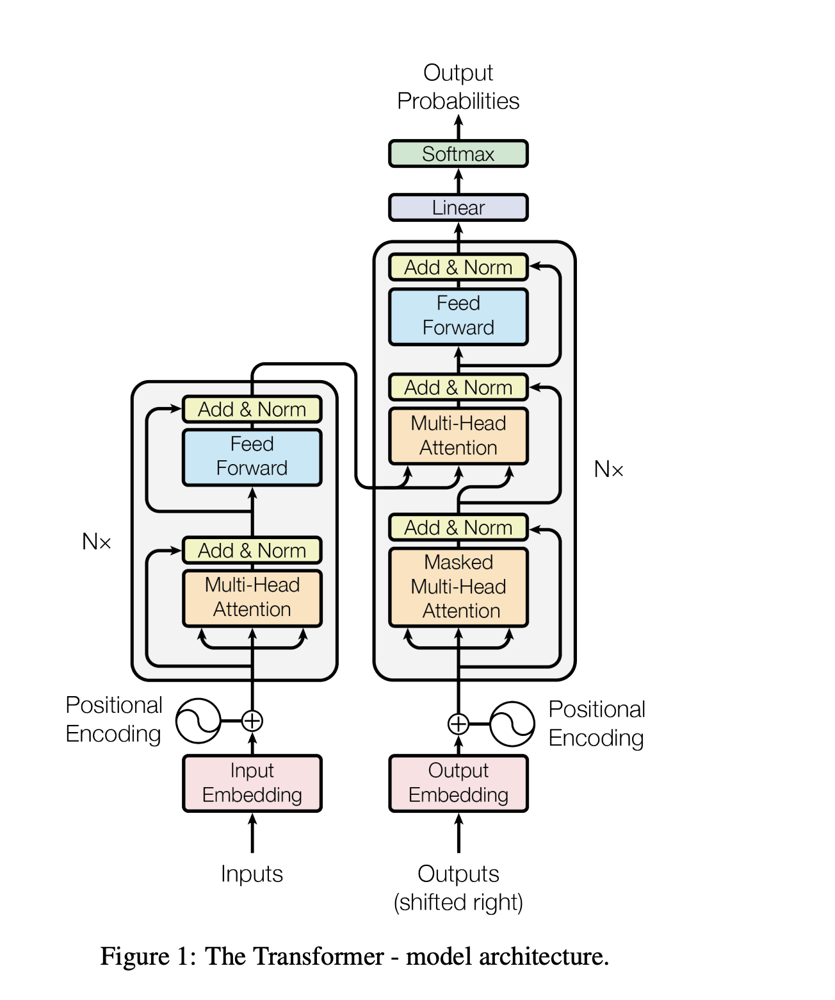

This architecture is called **post-norm** since the layer norm is applied to the output of each sublayer. But recent
work has shown that applying normalization before the sublayers improves training stability. This is called "**pre-norm**".
The pre-norm transfomer is now the standard used in modern language models (e.g. GPT-3, LLaMA, PaLM, etc.). That's
what we'll use in this project.

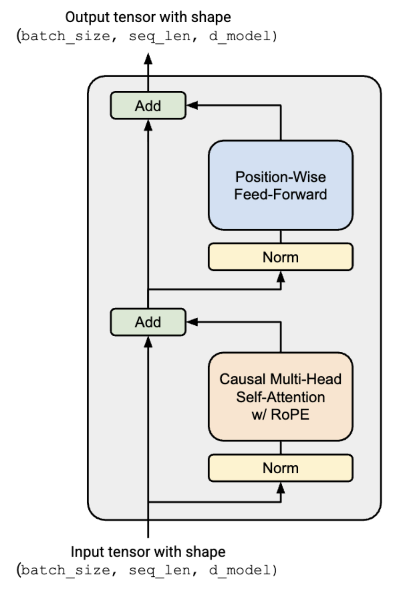

An intuition for pre-norm is that there is a clean “residual stream” without any normalization going from the input embeddings to the final output of the Transformer,
which is purported to improve gradient flow.

Related papers:
- [Batch Normalization: Accelerating deep network training by reducing internal covariate shift, 2015, Ioffe and Szegedy](Batch Normalization: Accelerating Deep Network Training by Reducing Internal Covariate Shift)
- [Layer Normalization, 2016, Ba et al (Introduces layer normalization as a better alternative to batch norm)](https://arxiv.org/abs/1607.06450)
- [Attention is all you need, 2017, Vaswani et al (OG Transformer architecture)](https://arxiv.org/abs/1706.03762)
- [Transformers without tears: Improving the normalization of self attention, 2019, Nguyen and Salazar](https://arxiv.org/abs/1910.05895)
- [On layer normalization in Transformer architecture, 2020, Xiong et al](https://arxiv.org/abs/2002.04745)

### 3.4.1 Root Mean Square Layer normalization

We're going to use `RMSNorm` activation:
Given a vector `a` with size `d_model` of activations, `RMSNorm` will rescale each activation `a[i]` as follows:

```
RMSNorm(a[i]) := (a[i] / RMS(a)) * g[i]
```

Where:

```python
RMS(a) := sqrt((1/d_model) * sum(i in 0..d_model: a[i]**2 + eps) )
```

Where `g[i]` is a learnable "gain" parameter (there `d_model` such parameters), and `eps` is
a hyperparameter that's often fixed to 1e-5.

The project instructions don't specify how to initialize the `g` vector, but the RMSNorm paper
provides a background of LayerNorm in chapter 3 and states that `g` is set to 1 at the beginning.

Related papers:
- [Root Mean Square Layer Normalization, 2019, Zhand and Sennrich (Introduces RMSNorm as an alternative to LayerNorm)](https://arxiv.org/abs/1910.07467)
- [LLaMA: Open and Efficient Foundation Language Models, 2023, Touvron et al (LLaMA uses pre-norm based on RMSNorm)](https://arxiv.org/abs/2302.13971)

**Note**: You should upcast your input to `torch.float32` to prevent overflow when you square the input. Overall,
your forward method should look like:

```python
in_dtype = x.dtype
x = x.to(torch.float32)
# Your code here performing RMSNorm
...
result = ...
# Return the result in the original dtype
return result.to(in_dtype)
```

I've implemented the `RMSNorm` module in [`nn_modules.py`](./nn_modules.py).

Note that I played around with dimensions using `einops` to ensure the aggregations
were applied to each sample in the batch indepedently. For example, the sum of squares
should be applied independently to each sample in the batch, i.e. whereas the
input is `(batch_size, d_model)` the output of the sum squares should be `(batch_size, 1)`
such that there's a separate sum of squares for each item in the batch. The sqrt and
additions/mulitiplications by scalars are all element-wise, so no issue there.

So the RMS part should be `(batch_size, 1)`, and when it divides the input x, which is `(batch_size, d_model)`
Then for each sample in the batch, the activations in that sample will be divided by the corresponding
rms of that batch item. We definitely want to avoid having the same rms divide all elements input tensor
regardless of batch item. The output of this operation is `(batch_size, d_model)`.

Finally, when `(batch_size, d_model)` is multiplied by the vector g `(d_model,)`, then standard
PyTorch broadcasting applies since the last dimensions are the same. So it will do
position-wise multiplication per batch sample.

I've implemented the `run_rmsnorm` test adapter in [`tests/adapters.py`](../tests/adapters.py).

To run the test:

```sh
uv run pytest -k test_rmsnorm
```

Tests pass:

```
uv run pytest -k test_rmsnorm
======================================================================== test session starts ========================================================================
platform darwin -- Python 3.11.12, pytest-8.4.1, pluggy-1.6.0
rootdir: /Users/habbes/code/learn/stanford-cs336-llm-from-scratch/assignment1-basics
configfile: pyproject.toml
plugins: jaxtyping-0.3.2
collected 48 items / 47 deselected / 1 selected                                                                                                                     

tests/test_model.py::test_rmsnorm PASSED

========================================================================= warnings summary ==========================================================================
tests/adapters.py:295
  /Users/habbes/code/learn/stanford-cs336-llm-from-scratch/assignment1-basics/tests/adapters.py:295: DeprecationWarning: invalid escape sequence '\T'
    """Given the weights of a Transformer language model and input indices,

-- Docs: https://docs.pytest.org/en/stable/how-to/capture-warnings.html
============================================================ 1 passed, 47 deselected, 1 warning in 0.56s ============================================================
```

### 3.4.2 Position-Wise Feedforward Network

In the original Transformer paper, the feed-forward network consists of two linear transformations with ReLU between them.
The dimensionality of the inner feed-forward layer is typically 4x the input dimensionality.

Modern LLMs tend to incorporate 2 design changes:
- they use a different activation function
- employ a gating mechanism

We'll use the **SwiGLU** activation function, which combines **SiLU** (also called Swish) activation
with a "gating mechanism" called **Gated Linear Unit (GLU)**. We will also omit the bias terms sometimes used in linear layers,
following most modern LLMs since PaLM [Chowdhery et al., 2022] and LLaMA [Touvron et al., 2023].

```
SiLU(x) = x * sigmoid(x) = x / (1 + e**-x)
```

Geometrically, SiLU looks like ReLU but has a smooth curve at x=0, which makes it continous and differentiable,
unlike ReLU which is not continuous, and therefore not differentiable, at x=0.

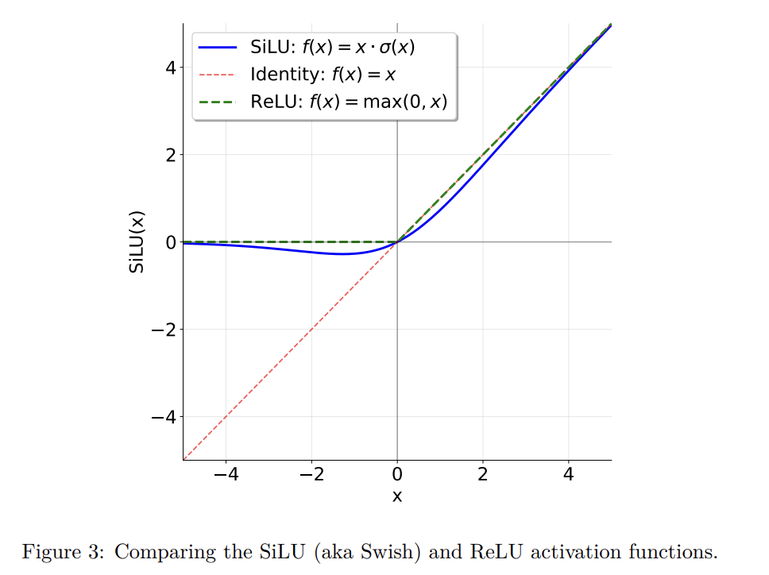

GLUs were originally defined as the element-wise product of a linear transformation passed through
a sigmoid function and another transformation:

```
GLU(x, W1, W2) = sigmoid(W1x) * W2x
```

GLUs are suggested to "reduce the vanishing gradient problem for deep architectures by
providing a linear path for the gradients while retaining non-linear capabilities".

Putting SiLU and GLU together, we get the SwiGLU, which we will use for our feed-forward network

```
FFN(x) = SwiGLU(x, W1, W2, W3) = W2(SiLU(W1x)) * W3x)
```


Shazeer [2020] first proposed combining the SiLU/Swish activation with GLUs and conducted experiments
showing that SwiGLU outperforms baselines like ReLU and SiLU (without gating) on language modeling
tasks. Though we’ve mentioned some heuristic
arguments for these components (and the papers provide more supporting evidence), it’s good to keep an
empirical perspective: a now famous quote from Shazeer’s paper is

> We offer no explanation as to why these architectures seem to work; we attribute their success,
> as all else, to divine benevolence.


I should implement the SwiGLU feed-forward network

**Note**: in this particular case, you should feel free to use `torch.sigmoid` in your implementation
for numerical stability.

You should set dff to approximately (8/3) × d_model in your implementation, 
while ensuring that the dimensionality of the inner feed-forward layer is a multiple of 64 to make good use of your
hardware.

I've implemented SwiGLU as the module `FFSwiGLU` in [`nn_modules.py`](./nn_modules.py). I used
the existing `Linear` module I implemented earlier for the linear layers.

For testing, I implemented the `run_swiglu` function in [`tests/adapters.py`](../tests/adapters.py).

To run the test:

```sh
uv run pytest -k test_swiglu
```

Tests passed:

```sh
uv run pytest -k test_swiglu
======================================================================== test session starts ========================================================================
platform darwin -- Python 3.11.12, pytest-8.4.1, pluggy-1.6.0
rootdir: /Users/habbes/code/learn/stanford-cs336-llm-from-scratch/assignment1-basics
configfile: pyproject.toml
plugins: jaxtyping-0.3.2
collected 48 items / 47 deselected / 1 selected                                                                                                                     

tests/test_model.py::test_swiglu PASSED

================================================================= 1 passed, 47 deselected in 0.47s ==================================================================
```

Related papers:

- [Gaussian Error Linear Units (GELUs), 2016, Hendrycks and Gimpel](https://arxiv.org/abs/1606.08415)
- [Sigmoid-Weighted Linear Units for Neural Network Function Approximation and Reinforcement Learning, 2017, Elfwing et al, (proposes SiLU)](https://arxiv.org/abs/1702.03118)
- [Language Modeling with Gated Convolution Networks, 2017, Dauphin et al (introduces GLU)](https://arxiv.org/abs/1612.08083)
- [GLU Variants Improve Transformer, 2020, Shazeer](https://arxiv.org/abs/2002.05202)
- [PaLM: Scaling language modelling with Pathways](https://arxiv.org/abs/2204.02311)
- [The Llama 3 Herd of Models, 2024, Grattafiori et al](https://arxiv.org/abs/2407.21783)
- [Qwen 2.5 Technical Report, 2024, Yang et al](https://arxiv.org/abs/2412.15115)

### 3.4.3 Relative Position Embeddings

Before tackling Rotary Position Embedding module, I found it beneficial to first understand
the rationale behind positional embeddings, understand the PE algorithm used in the original transformer paper (Vaswani et al 2017)
and contrast that with RoPE which we implement here.

So why positional embeddings? In sequence-to-sequence language model architectures based on RNNs and LSTMs, the model
learns to attend to the relative position of words based on the fact that hidden state `s[t]` is a function of `s[t-1]`.
However, this recursive definition forces operations to be sequential and makes parallelism difficult.

#### Desired properties of Positional Encoding

In the Transformer architecture, we also want a way to encode and attend to relative position of words/tokens. So
we need to devise a positional encoding mechanism. Unlike with RNNs, we want an encoding that can be computed
in parallel for better efficiency. In general, we want an encoding function with the following properties:

- **Uniqueness**: Each position maps to a different vector, so the model can distinguish positions
- **Smoothness/continuity**: Nearby positions have similar positions, so the model can generalize patterns like "next word", "previous word"
- **Relative information is recoverable**: The model can infer distance between positions, direction (before/after). `f(pos+k)` is predictable from `f(pos)`. This is the most important property.
- **Linear usability**: Relative shifts can be expressed via linear operations (dot products, linear layers, etc.) since transformers are generally made up of linear operations and attentions.
- **Parallel computability**: No dependence on previous tokens.

#### Position Encoding function in original Transformer

In the original Transformer, the position encoding function is applied before the encoder and decoder blocks, i.e. before the
self-attention mechanisms. i.e. the PE function is applied to the input and output embeddings, the resulting positional
embeddings are sent as input to the encoder and decoder respectively.

i.e 

```python
input = embedding + PE(pos)
```

The encoding function used is the following sinusoidal function:

```python
PE[pos, 2i] = sin(pos/10000**(2i/d_model))
PE[pos, 2i + 1] = cos(pos/10000**(2i/d_model))
```

Where `pos` is the token position in the sequence, `i` is the feature index in input embedding vector and `d_model` is
the length of the embedding vector.

Each dimension of the positional encoding corresponds to a sinusoid.
They chose this function because they hypothesized it would allow the model to easily learn to attend by
relative positions, since for any fixed offset `k`, `PE(pos+k)` can be represented as a linear function of
`PE(pos)`.

Let's break down this function in more detail:

This encoding treats the embedding vector as a sequence of coordinates pairs in 2D space, i.e. (E[2i], E[2i + 1]) is
a single point. And we derive an angle `pos/10000**(2i/d_model)` from each point `(E[2i], E[2i+1])` for
which we compute the sin and cos which we store in the resulting `PE` vector.

In this case, we can think of the resulting `PE` vector as a high-dimensional clock or binary counter.

#### Geometric intuition:

Think of a binary counter:
- in the least significant bit, the value flips every step (0, 1, 0, 1...)
- in the next bit, it flips every two steps (0, 0, 1, 1, ...)
- The higher the bit, the slower the change, i.e. the lower the frequency or the longer the wavelength

The sinusoid functions achieve the same concept but with continuous waves instead of discrete bits:
- For lower values of i (start of the vector), the frequency is very high. The values jitter
rapidly as you move from one word to the next
- For high values of i (the end of the vector), the frequence is very low. The values change very slowly across the sequence.

For a given position `pos`, you get a vector like:

```python
[fast_wave(pos), ..., medium_wave(pos), ..., fast_wave(pos)]
```

By combining these, every position gets a unique signature. It's like a clock where the "seconds" hand moves fast
and the "hours" hand moves slow; by looking at all hands at once, you can tell the exact time.

#### Why sin and cos for even and odd i?

So that the model is able to represent relative positions. For any fixed `k`,
`PE(pos + k)` can be represented as a linear transformation for `PE(pos)`.

Using sin-cos pairs creates a rotation. If you have point `(sin(x), cos(x))` and you want to move to
`(sin(x + k), cos(x + k))`, you can do so by multiplying the original point by a simple rotation matrix. Conceptually
this allows the attention mechanism to "feel" the distance between words (pos and pos+k) purely by calculating
their dot product, regardless of where they are in the sentence

#### Why 10,000?

The `10000**(2i/d_model)` term determines the wave length. Shortest wavelength is `2pi` at i = 0. Longest is 10000 * 2pi at i = d_model/2.
The number 10000 is somewhat arbitary, but it ensures that even for very long sequences, the "slowest" wave hasn't completed a full
cycle yet. This provides a unique gradient for every position up to a very large sequence length. Hypothetically, it would
help the model handle sequence lengths longer than the sentences it saw in training.

#### What makes sinusodial encoding suitable?

Now it should be clearer to understand why this sinusoidal function makes sense for positional encoding in the Transformer:

- Unique identity: Different positions -> different phase combinations
- Smoothness: sine/cosine change continuously -> differentiable
- Relative structure: A shift in position = predictable transformation with linear ops
  - Trig identities:
    - `sin(a + b) = sinacostb + cosasinb`
    - `cos(a + b) = cosacosb - sinasinb`
- Multi-scale distances: different frequences encode short-range relationships, long-range relationships, etc.
- Parallel computation: Each position can be computed indepedently

### What makes RoPE different?

In this project, we're asked to implement Rotary Positional Embeddings. Why is different/better from the original attention?
Two of the key differences between RoPE and the original PE is that:
- RoPE is applied directly to the attention mechanism, not on token embeddings
- RoPE cares about relative positions, not really about absolute positions of tokens.

**Note**: I found this video useful in explaining RoPE: [How Rotary Position Embedding Supercharges Modern LLMs [RoPE]](https://www.youtube.com/watch?v=SMBkImDWOyQ).

In the original PE, content (input embeddings) and positions are mixed "too early"
in the pipeline, given that attention is computed a bit later. Attention is still
based on content (Q and K vectors) and only indirectly/implicitly extracts relative
position information from the position embeddings.

In RoPE the position encoding function is applied directly to Q and K vectors in
the attention mechanism. RoPE rotates Q and K vectors by an angle proportional
to the position. After rotation, `Q[i]` and `K[j]` become a function of (i - j).
The dot product now directly depends on relative position.

Why is this better?

- Relative position is built-in
  - Instead of learning:
    - "token 5 should attend to token 3"
  - The model naturally gets:
    - "distance = 2 affects attention"
- Translation invariance
  - If you shift the whole sequence:
    - original encoding: representations change globally
    - RoPE: relative relationships stay the same
- More efficient learning
  - The model doesn’t need to "discover" relative position:
  - It’s already encoded in the dot product

In RoPE, the q_i vector of size d is also treated as a collection of d/2 coordinate pairs in 2D space
from which d/2 angles are computed based on the token position i.

The angle is computed as

```python
angle[i, k] = i / (theta ** ((2k - 2)/d)
```

Where `theta` is some constant provided as a hyperparameter of the `RoPE` function (similar to the 10000 used in the original PE).
And k is in range [1..d/2]. Since k starts from 1, 2k-2 starts at 0, then 4, then 6, etc. up to d/2.


RoPE applies a 2x2 rotation matrix `R` to each coordinate pair, to rotate it by the corresponding angle:

```python
R[i,k] =
[
  [cos(angle[i,k]), -sin(angle[i, k)]
  [sin(angle[i,k]),  cos(angle[i, k])]
]
```

To apply this matrix in parallel to all coordinate pairs, we consider `R[i]` to be a block-diagonal matrix
of size d*d such that

```python
R[i] = 
[
  R[i, 1], 0,      0,      ...0
  0,       R[i,2], 0,      ...0
  0,     , 0,      R[i,3], ...0
  0,     , 0,      0,      ...R[i,d/2]
]
```
When expanded, it looks like this:

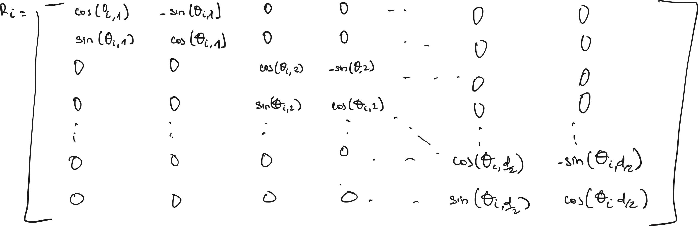

And with expanded angles:

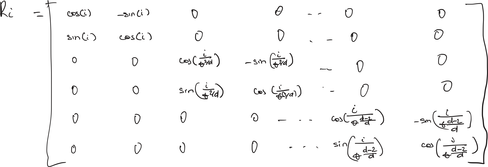


Note that this is only R[i], so we'll compute such a matrix for each token position i. Since
the matrix has fixed values for each position and d dimensions, and as hinted to by the instructions,
we can compute the full matrix ahead of time for each possible position up to some `max_seq_len` and cache
it. Since it doesn't have any learnable parameters and we don't want to have gradients computed for it,
we won't create an `nn.Parameter` wrapper for it. But since we still want it to be part of the model's
architecture, we'll cache it using [`register_buffer`](https://docs.pytorch.org/docs/stable/generated/torch.nn.Module.html#torch.nn.Module.register_buffer). This will ensure that when the model is moved to a
target device, that the PE matrix is moved as well. We'll set `persistent` to false because we don't
want its values to be serialized when the model saved (or deserialized).

So we'll create a rotation matrix with dimensions `(max_seq_len, d_k, d_k)` and initialize it
with all required cosines and sines in the block diagonal dimensions, then in the
`forward()` method we'll use the `token_positions` input to extrac just the rotation matrices
for the target positions and apply the rotations to the batched inputs.

I've implemented the `RotaryPositionalEmbedding` module in [`nn_modules`](./nn_modules.py).
I implemented the `run_rope` adapter function in [`tests/adapters.py`](../tests/adapters.py).

To run the test:

```sh
uv run pytest -k test_rope
```

```sh
uv run pytest -k test_rope                           
======================================================================== test session starts ========================================================================
platform darwin -- Python 3.13.9, pytest-9.0.2, pluggy-1.6.0
rootdir: /Users/habbes/code/learn/stanford-cs336-llm-from-scratch/assignment1-basics
configfile: pyproject.toml
plugins: jaxtyping-0.3.9, timeout-2.4.0
collected 48 items / 47 deselected / 1 selected                                                                                                                     

tests/test_model.py::test_rope PASSED

================================================================= 1 passed, 47 deselected in 0.10s ==================================================================
```

Related papers:

- [RoFormer: Enhacing transformers with rotatary position embedding, 2021, Jianlin Su et al.](https://arxiv.org/abs/2104.09864)

### 3.4.4 Scaled Dot-Product Attention

In this section we'll implemented scaled dot-product attention based on the original transformer Paper.

But before that, we'll first implement our version of `softmax`. The softmax function is used
to transform an unnormalized vector of scores in to a normalized distribution with
values in range [0..1] that sum to 1 (probability distribution):

```
softmax(x) = exp(x) / sum(exp(x))
```

`exp(x)` can become `inf` for large values, resulting in `inf/inf` == `NaN`. We can avoid
this by subtracting the max value from each score, this will bound the resulting vector
to a max value of `0`, which avoids the overflow.

This trick works because:

```python
exp(x + c) / sum(exp(x + c)) == exp(x) / sum(exp(x))
```

for some constant `c`.

We can easily demonstrate that:

```python
exp(x + c) / sum(exp(x + c))

== exp(x) * exp(c) / sum(exp(x) * exp(c))

== exp(x) * exp(c) / exp(c) * sum(exp(x))

# If we cancel out exp(c) from the numerator and denumerator
# we get softmax(x)

== exp(x) / sum(exp(x))

== softmax(x)
```

I've implement `softmax` as simply the function `softmax` in [`nn_modules.py`](./nn_modules.py).

I've implemented the adapter `run_softmax` in [`tests/adapters.py`](../tests/adapters.py).

To run tests:

```sh
uv run pytest -k test_softmax_matches_pytorch
```

```sh
uv run pytest -k test_softmax_matches_pytorch
======================================================================== test session starts ========================================================================
platform darwin -- Python 3.13.9, pytest-9.0.2, pluggy-1.6.0
rootdir: /Users/habbes/code/learn/stanford-cs336-llm-from-scratch/assignment1-basics
configfile: pyproject.toml
plugins: jaxtyping-0.3.9, timeout-2.4.0
collected 48 items / 47 deselected / 1 selected                                                                                                                     

tests/test_nn_utils.py::test_softmax_matches_pytorch PASSED

================================================================= 1 passed, 47 deselected in 0.07s ==================================================================
```

Now to scaled dot-product attention. We have query, key and value vectors. 
At a given position, the query vector associated with that position represents "what am I looking for",
we'll perform a dot-product between the query and the keys of all the positions. That key
represents some queryable metadata about a position, whereas the value represents the "content".
The product of the query and all the keys represent how strongly this position relates
to each other position. We use softmax to transforms these "scores" into normalized weights. We
use these weights to compute a normalized average of the values.

The query, key and value vectors are packed into matrices for parallel computation.

```python
Attention(Q, K, V) = softmax((Q @ K.T) / sqrt(d_k))V
```

Where Q => `(n, d_k)`, K => `(m, d_k)` and V => `(m, d_v)`. Here Q, K, V are all inputs to the operation.

And the output has dimensions `(n, d_v)`.

**They are not learnable parameters**

In the Transformer paper, they found that large values of the dot products would lead to poor training performance,
supposedly because large values push softmax to values that have very small gradients, which slows down learning.
They countered that by scaling by `1/sqrt(d_k)`.

**Notes on dimensions**:

Note that query and key vectors need to have the same dimensions (`d_k`) since they're operands of the dot product,
but it's not technically required for value vectors to have the same dimensions, that's why we use `d_v`. But in
our implementation, we'll use the same dimension so `d_k` == `d_v`. Also note that there n query vectors
and m key vectors and also m value vectors. This means the number of query vectors can be different from the number of key vectors,
but the number of key vectors and value vectors must be the same. This is because in general, queries and keys
can come from different sequences, which may have different sequence lengths. For example, in a translation task,
then input and output sequences are different, the queries come from the input sequence and the keys and values
come from the output sequence, this would be **cross-attention**. In this implementation we'll be doing **self-attention**
where queries, keys and vectors all derive from the same sequence (since the source sequence is also the target sequence for the next token prediction task) and n == m. But since we're implementing the scaled dot-product attention as a utility function that does not know where the queries, keys, values
it receives as parameters come from, we implement it in a generalized form. The result of the operation will have dimensions
`(n, d_v)`.

**Break down attention operation**

I'm adding this updated section after having realized that I had the wrong idea of what operationa attention computes for a long time.
I used to think attention is computing scores/weights for scaling the value vectors. That's incorrect! I realized after
reviewing the equation by hand that it computes for each input sequence position a new value vector that is an element-wise
weighted average of all the input value vectors. The weights are derived from the scaled dot products of the query vector at that position with
all the key vectors and converting them to a probability distribution using softmax.

Let's break this down in more detail. For demonstration, we'll ignore batching and just work with one input sequence.

We have a source sequence of size n, so there are n query vectors of dimension d_k, on for each position each. We pack
this in a matrix of Q of dimensions (n, d_k) where each row is query vector. We also assume we have a target sequence of size m. K is a matrix (m, d_k)
where each of the m rows is a d_k dimension key vector. V is a matrix (m, d_v) where each of the m rows is
a d_v dimension value vector.

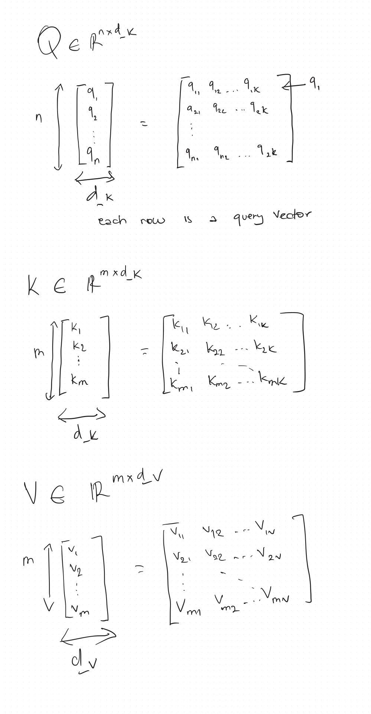

Now for each position i in the source sequence, we take the query vector at that position and compute a dot product with each key vector in the
target sequence. Remember that the dot product of two vectors is a scalar. We can consider this as an unnormalized scores, telling us how strongly
this query correlates with that key. So we'll have m unnormalized scores for each query. This is essential vector-matrix multiplication,
between a single query vector of dimension (1, d_k) and the K matrix of m keys, but we have to transpose for the dimensions to align
for vector-matrix multiplication: (1, d_k) @ (d_k, m) => (1, m):

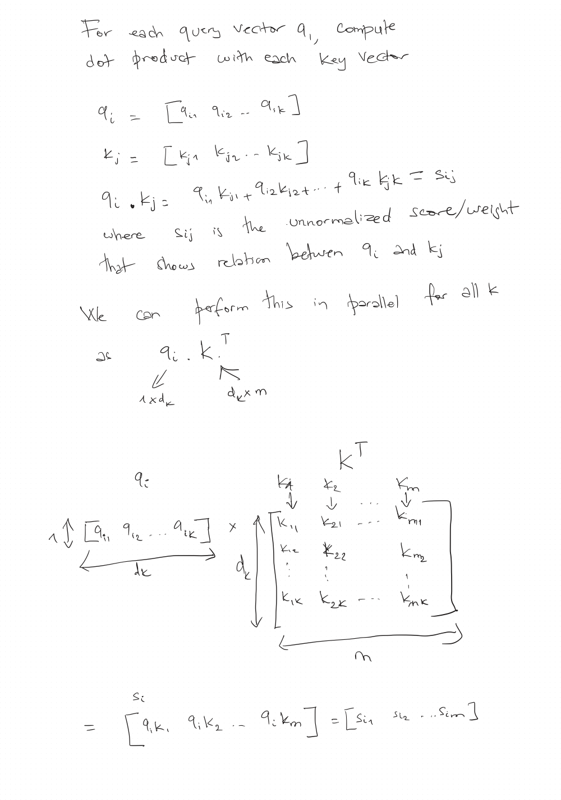

In the diagram above, the `s_i` vector contains the "unnormalized scores" corresponding to query `q_i`. Now we can parallelize
this computation for all queries using simple matrix-matrix multiplication between query matrix Q and key matrix K:

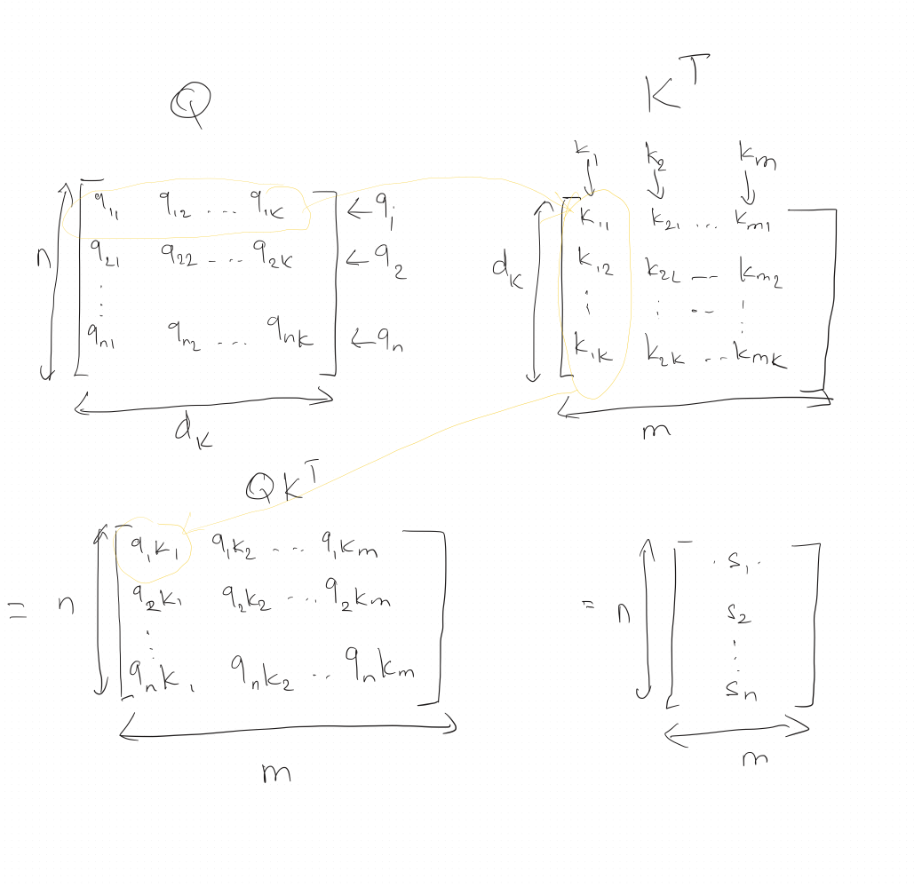

This returns a matrix where each row `i` is a vector `s_i` that contains the unnormalized attention scores for the corrsponding
query position. This completes the dot production part of the function definition, i.e. the `Q @ K.T` part. The scaling
part is simple, we just divide each element of the matrix by the constant `sqrt(d_k)`.

Next we want to normalize each row of scores into a probability distribution (where each entry is between 0 and 1 and they sump to 1)
using the `softmax` operation. Again, note that the softmax is applied indepedently for each row (in parallel). So, conceptually, the input
to each softmax operation is a vector of size `n` (source sequence length). So for some row i, the softmax operation might produce
a resulting normalized weights row that looks like `[0.2, 0.1, 0.1, 0.6]`. In this example, the last key (k_3) has the strongest correlation with
q_i, which mean that source token at pos i will have stronger attention to target token at position 3. Note that the weights in that vector sum up to 1.

Here's a more detailed breakdown of the computation

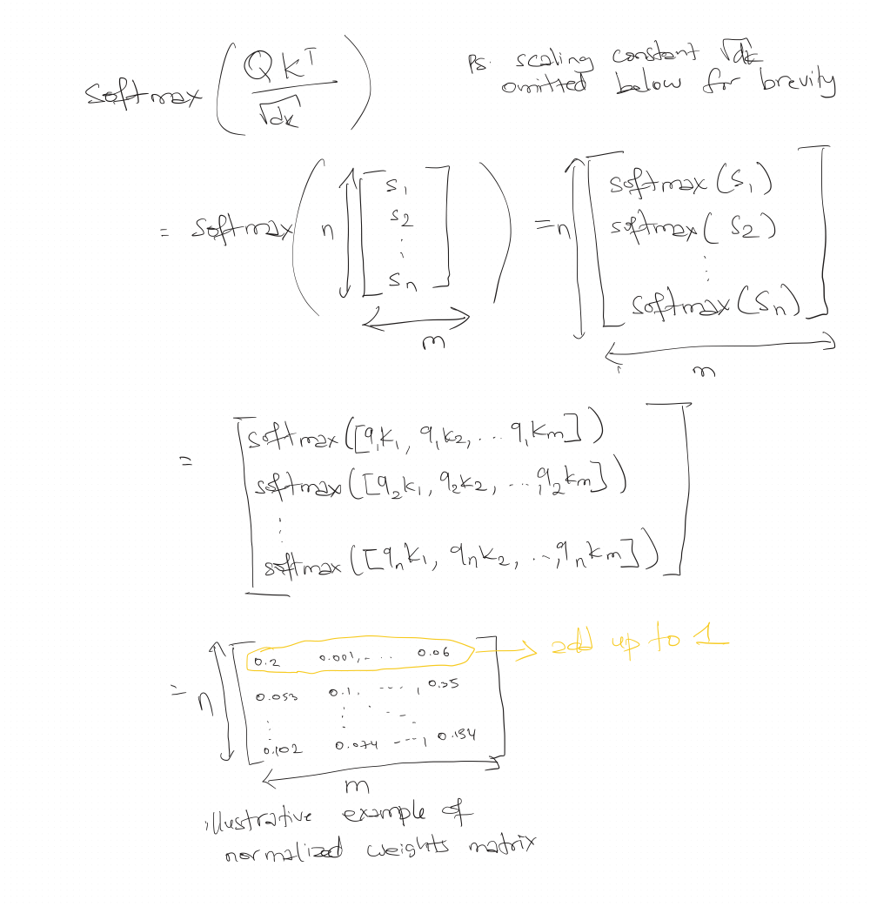

The last part is to multiply the weights by the values vector. I had this part wrong for a long time, so let me break it down make it
clear what's going. Let's say we have m = 4 and d_v = 2, so 4 value vectors with 2 elements each:

```python
V = [
  [0.1, 0.5],
  [0.2, 0.8],
  [0.4, 0.5],
  [0.3, 0.2]
]
```

And a weight vector retrieved from the previous softmax operation

```python
w_i = [0.2, 0.1, 0.1, 0.6]
```

If we do the dot product `w_i @ V` we get a single output vector of size 2 where each dimension j
is a weighted average of the j_th elements from all the vectors, based on the weights in w_i:

```python
o_i = [
  w_i @ V[:, 0],
  w_i @ V[:, 1]
]

```python
o_i[0] = w_i @ V[:, 0] =  0.2 * V[0][0] + 0.1 * V[1][0] + 0.1 * V[2][0] + 0.6 * V[3][0]
o_i[1] = w_i @ V[:, 1] =  0.2 * V[0][1] + 0.1 * V[1][1] + 0.1 * V[2][1] + 0.6 * V[3][1]
```

```python
o_i = [
  0.2 * 0.1 + 0.1 * 0.2 + 0.1 * 0.4 + 0.6 * 0.3,
  0.2 * 0.5 + 0.1 * 0.8 + 0.1 * 0.5 + 0.6 * 0.2
]
```

```python
o_i = [0.26, 0.35]
```

So the output vector o_i is a commbination of all the value vectors based on the weights w_i. All the value vectors
contribute to this output, but biased towards the values where corresponding to the keys that the query attends the most
to. This is the essence of the at the attention operator, to combine the values corresponding to the output sequence in
a way that reflects the attention the query has over the corresponding keys.

Of course, now we apply this operation in parallel for all weight vectors via matrix multiplication. But it's important
to think of each resulting row as independently combuting the weighted average value vector mapped to the query (and source position)
corresponding to that row.

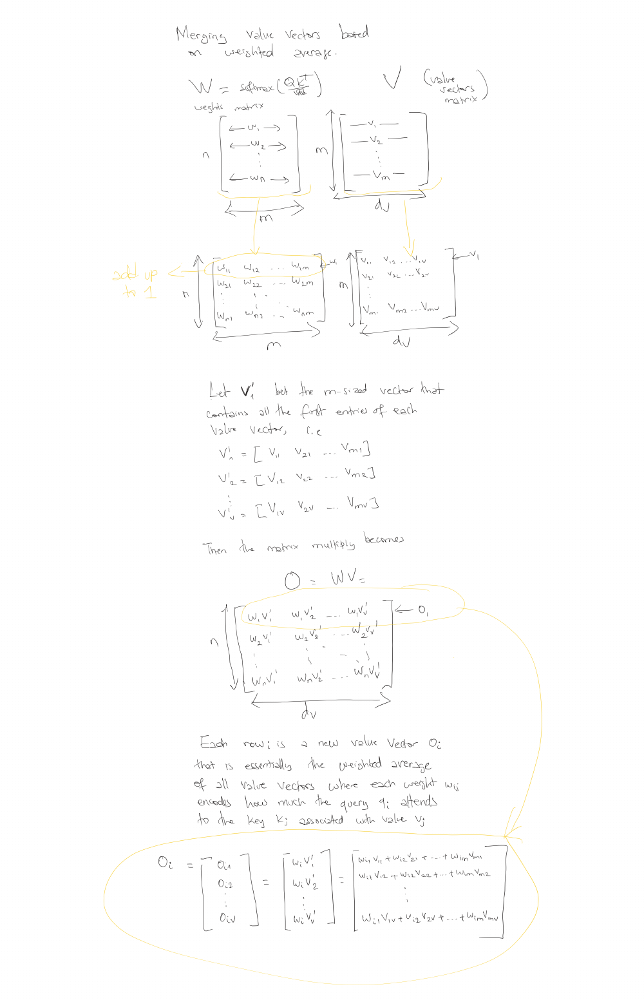

**Masking** Sometimes we mask the output of an attention operator to avoid certain positions from attending to each other.
For example, in the decoder we may not wan't tokens to attend to "future" tokens.
A mask is typically a matrix M of `True` and `False` values of shape (n, m). Each row i indicates which keys the query i
should attend to. A value of `True` at position (i, j) indicates that the query i does attend to the key j and `False`
indicates that the query does not attend to the key.

For example, consider a (1, 3) mask matrix with entries `[[True, True, False]]`.
The single query vector attends only to the first two keys.

Computationally, it will be much more efficient to use masking than to compute attention on
subsequences, and we can do this by taking the pre-softmax values `(Q @ K.T) / sqrt(d_k)` and adding a `-inf` to
any entry of the mask matrix that is False. (Note `exp(-inf) == 0`)

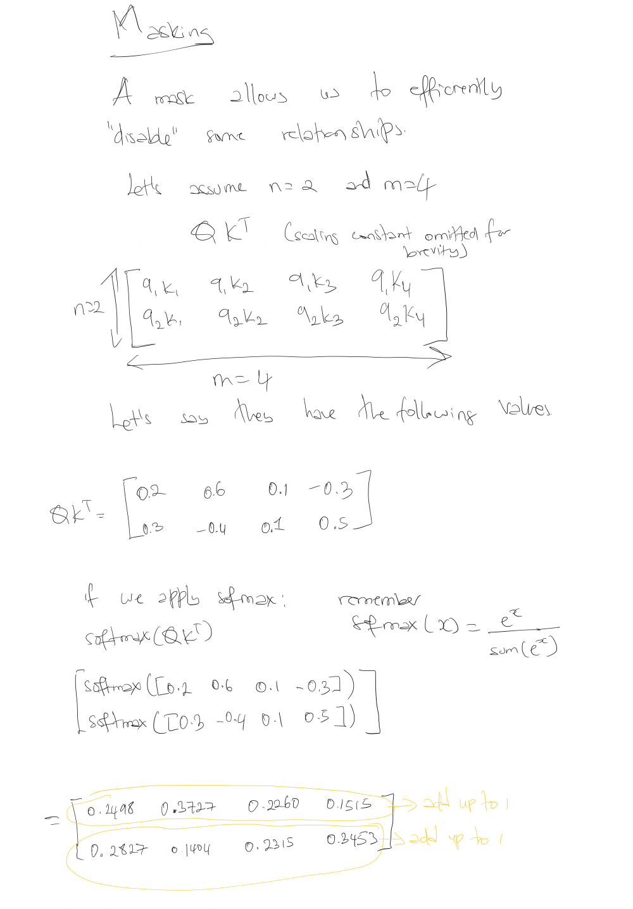

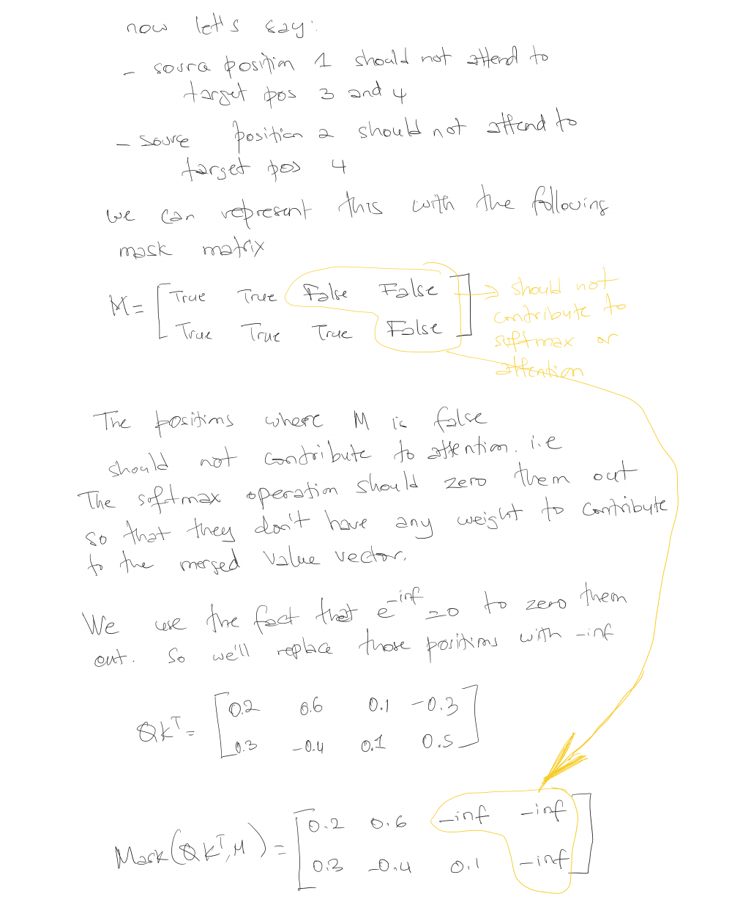

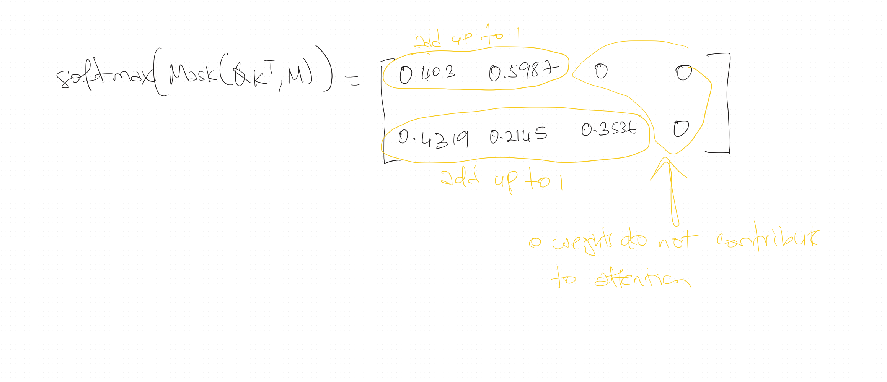


Of course, we have to remember that when implementing these operations, they'll be batched. Each
batch item is independent, so we'd be computing scaled dot-product attention in parallel across
independent items. I'll use `einsum` for the batched matrix multiplication for the simplicity.

I implemented the `scaled_dot_product_attention` function in [`nn_modules.py`](./nn_modules.py).

I implemented the `run_scaled_dot_product_attention` function in [`../tests/adapters.py](../tests/adapters.py).

To runt tests:

```sh
uv run pytest -k test_4d_scaled_dot_product_attention
```

```sh
uv run pytest -k test_4d_scaled_dot_product_attention
======================================================================== test session starts ========================================================================
platform darwin -- Python 3.13.9, pytest-9.0.2, pluggy-1.6.0
rootdir: /Users/habbes/code/learn/stanford-cs336-llm-from-scratch/assignment1-basics
configfile: pyproject.toml
plugins: jaxtyping-0.3.9, timeout-2.4.0
collected 48 items / 47 deselected / 1 selected                                                                                                                     

tests/test_model.py::test_4d_scaled_dot_product_attention PASSED

================================================================= 1 passed, 47 deselected in 0.09s ==================================================================
```

### 3.4.5 Causal Multi-Head Self-Attention

In this section, we'll implement multi-head self-attention as described in the Attention Is All You need Paper. But before we get into that, I'd like to break down the terms Causal Multi-Head Self-Attention:

- **Self-Attention**: We'll be applying attention on the input sequence, i.e. tokens in the input sequence attend to other tokens in the same input sequence. Queries, keys and values come from the same sequence. This is distinct from cross-attention where we have different source and target sequences.
- **Multi-Head**: We'll concatenate different independent attention blocks or heads over the same sequence instead of having just one attention operation.
- **Causal**: Since our task is next-token-prediction given current sequence of tokens, our training will treat a token in the sequence as target taken given the tokens in the context that precede it. To prevent "cheating", we'll prevent the target token from attending to tokens that come after it in the sequence.

Why multiple attention heads? We can consider that the attention mechanism discovers relationships between words/tokens and which tokens have the strongest relationships with each other. In language, there are many types of inter-word relationships that are simultaneously at play in a given sentence.

For example, given the sentence "The animal didn't cross the street because it was too tired."

When we read "it", we can ask a lot of questions to reason about what it refers to:

- Which noun is closest?
- Which noun makes grammatical sense?
- Which noun is capable of being tired?
- What's the overall topic of the paragraph?
- What happened previously?

A single attention mechanism has to mix all these into one set of attention weights. For each token, it computes a single
probability distribution over every other word. Yet in reality, given some word or token A, one token B may have the strongest
attention when considering some lens or type of relationship, while another token C has the strongest attention when looking
at a different lense. We lose out on the ability to properly capture these different lenses if we only have a single
probability distribution per source word.

With multi-head attention, instead of forcing a single attention mechanism to solve every problem, we give several
independent attention mechanisms (attention heads) different parameters and let each specialize.

Now let's discuss the formulae.

#### MultiHead

We define MultiHead function as:

```python
MultiHead(Q, K, V) = Concat(head_1, head_2, ..., head_h)
```

Where

```python
head_i = Attention(Q_i, K_i, V_i)
```

Here `Q` can be considered a concatenation of h indepedent query sub-matrices, same for `K`, and `V`.

Therefore `Q_i`, `K_i` and `V_i` are slice number `i` of [1, h] of size `d_k` of the embedding dimension of `Q` and `K` and size `d_v` for `V`.

Where `Attention(Q_i, K_i, V_i)` is the scaled-dot product attention operation we implemented in the previous section: `softmax(Q_i @ K_i/sqrt(d_k))V`.

We have `h` heads, each one with its own independent set of query, key and value matrices independently computing the attention operation. Then the results are concatenated into a single matrix.

Conceptually, we'd expect the output of the `MultiHead` operation to have the shape (where n is the sequence length):

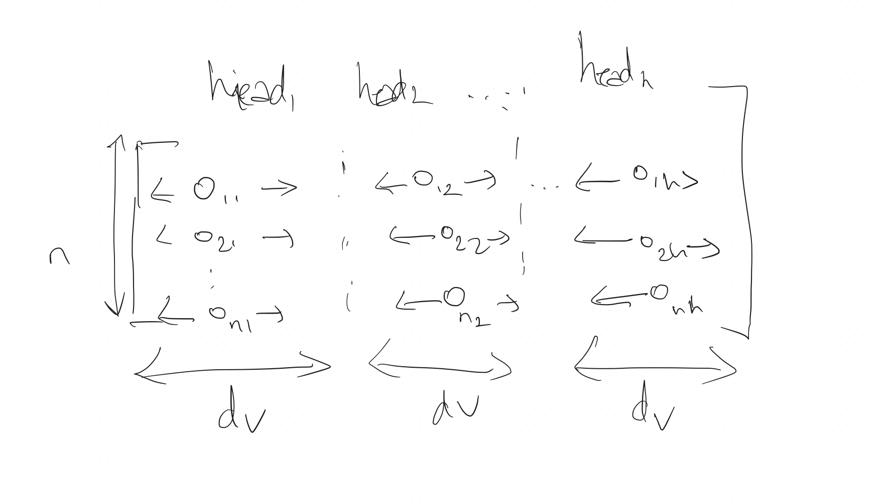

#### MultiHeadSelfAttention

To compute the `MultiHeadSelfAttention` function for a given input, we create matrices of learnable parameters that apply to the input to produce query, key and value matrices that we pass as input to the `MultiHead` operation:

```python
MultiHeadSelfAttention(x) = W_O @ MultiHead(W_Q @ x, W_K @ x, W_V @ x)
```

Learnable parameters are:

- `W_Q` of shape `(h * d_k, d_model)`
- `W_K` of shape `(h * d_k, d_model)`
- `W_V` of shape `(h * d_v, d_model)`
- `W_O` of shape `(d_model, h * d_v)`

Since Q, K and V sliced in the multi-head attention operation, we can think of `W_Q`, `W_K`, `W_V` as being separated for each
head along the output dimension.

Let's break this down a bit further.

Let's start by looking at how the query matrix is produced from the `W_Q` matrix. First, let's assume that `x` is a single token's embedding.
So it's a vector of size `d_model`. Then later we'll expand the reason to support the entire sequence.

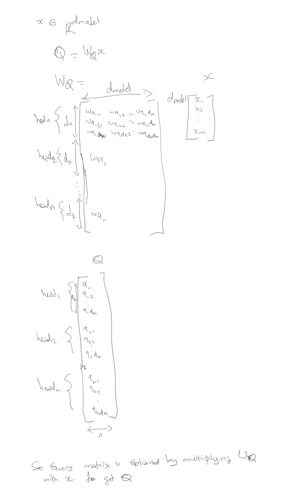

This shows that we'll have a different query vector of size d_k per head. While we demonstrate the computation for Q, a similar process applies for K and V.

No let's see how this applies to a sequence of `n` input token embeddings. Remember that in the attention operation, we expect Q to be a matrix of query vectors, a separate query vector per token position. Now in this case we going to have a different query vector per head and per token position.
To compute this, we'll simply apply the `W_Q` weights to the entire input sequence.

**Notes about shape**: Now, we expect the input sequence `x` to be a matrix of shape `(n, d_model)` (n input token embeddings of size `d_model`). Note that if
multiply `W_K @ x` as mentioned above the matrix multiplication won't work cause the dimensions don't line up, i.e. `(h * d_k, d_model) @ (n, d_model)`.
So we would need to transpose `x` to get `W_K @ x.T` with shapes `(h * d_k, d_model) @ (d_model, n)`, we can treat x.T as n column vectors.
Alternatively, we could transpose `W_K` and swap the operations: `x @ W_K.T` with shapes `(n, d_model) @ (d_model, h * d_k)`. The two return
conceptually equivalent results. But the row-vectors approach (`x @ W_K.T`) aligns better with PyTorch's row-wise memory ordering. In this breakdown we'll go with the first approach of transposing `x` because it matches the order operands in the formula provided in the assignment brief. However, during implementation we'll use `einsum` to align the shapes automatically for simplicity. This is a recap of what was mentioned remarks about mathematical notation and memory ordering.

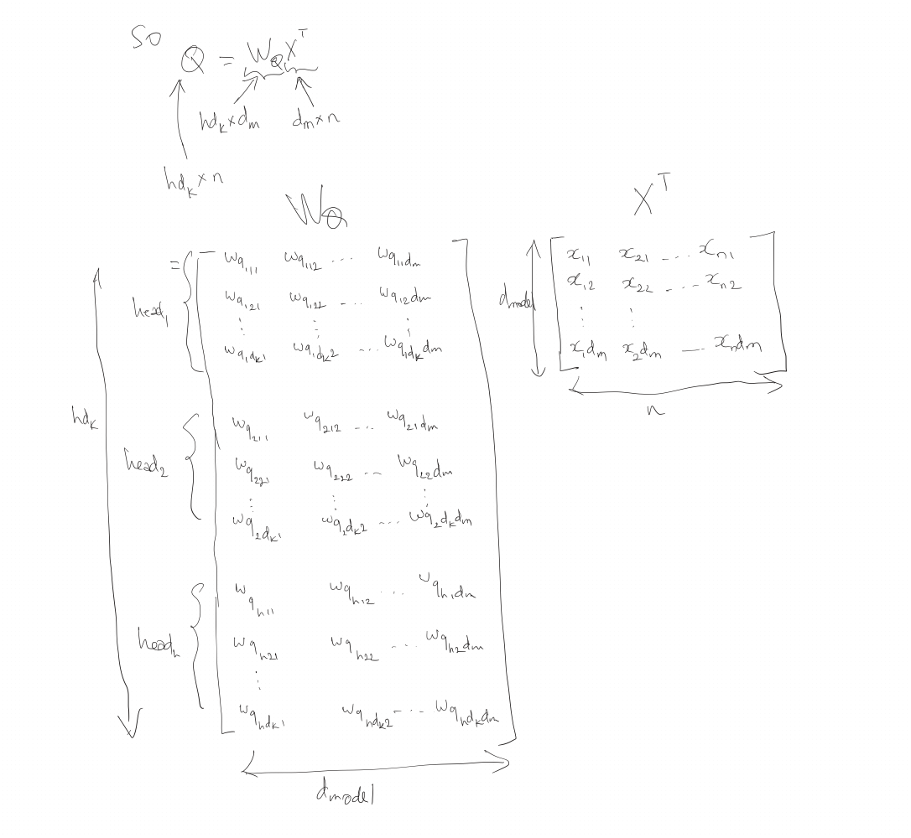

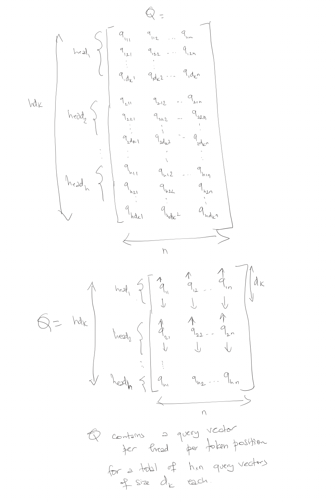

Now that we know how to compute the `Q` matrix (and subsequently `K` and `V`), we can pass these inputs to the `MultiHead` function.

```python
MultiHead(W_Q @ x.T, W_K @ x.T, W_V @ x.T) = MultiHead(Q, K, V)
```

where `Q` contains `n` query vectors per head.

Remember that multi head operation is equivalent to conctatenating h attention operations:

```python
MultiHead(Q, K, T) = concat(Attn(Q_1, K_1, V_1), Attn(Q_2, K_2, V_2), ... Attn(Q_h, K_h, V_h))
```

The result is an output matrix `O` which contains n "composite" value vectors per head, i.e. `(h * d_v, n)`.
By composite value vector, I mean each value vector is a weighted average of the original value vectors in the same
head based on the attention weights.

Then to complete the `MultiHeadSelfAttention` function, we apply the `W_O` weights matrix transformation to
output matrix `O` of composite value vectors.

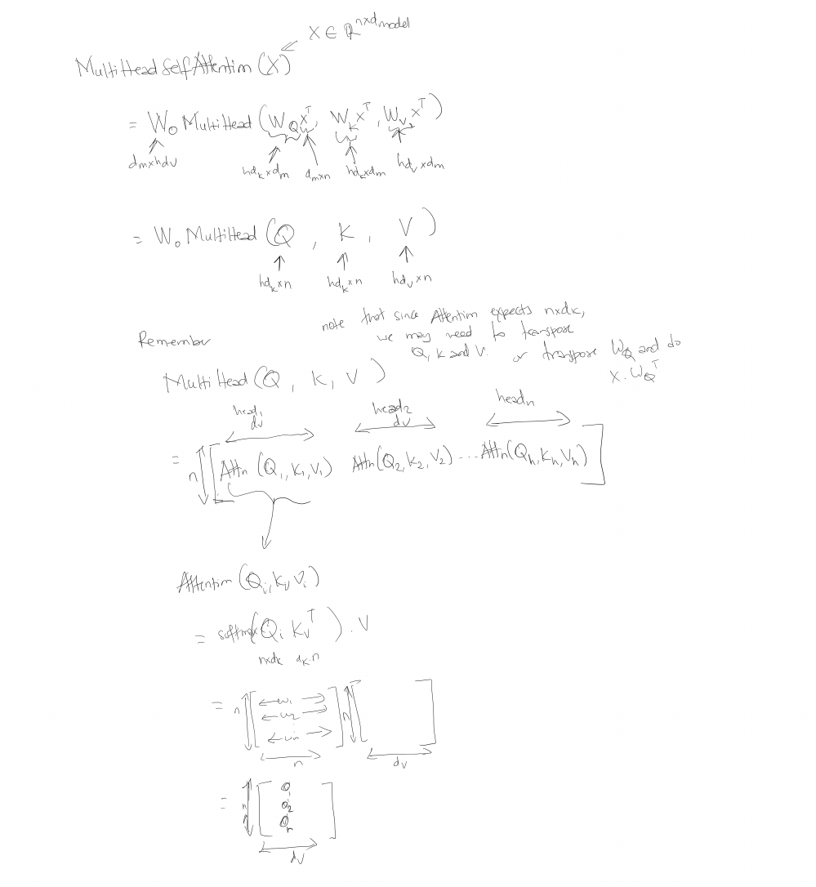
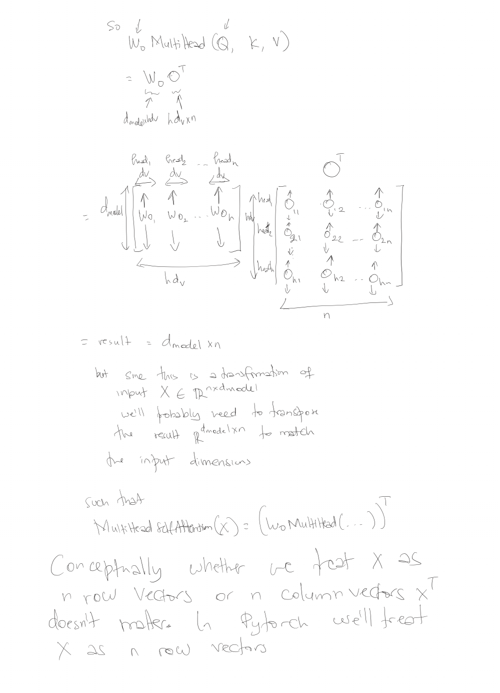

Remember `W_O` is a matrix of shape `(d_model, h * d_v)` and `O` is (`h * d_v`, `n`). The `W_Q`, `W_K`, `W_V` matrixes extract
query, key and value vectors out of the input embedding space X where each object is a `d_model` vector. The `W_O` matrix
learns how to combine the information discovered by the different heads into a single representation that live's in the model's embedding representation space, i.e `(n, d_model)` matrix. `W_O` mixes information across heads, otherwise they're isolated/independent from each other.

So in summary, the whole multi-head self attention operation transforms the input x, which contain token embeddings that may contain some intrinsic representation of a word, into some output y where the embedding vectors now encode information about the word in the context of the sentence. i.e: **Turn independent token representations into context-dependent token representations.**

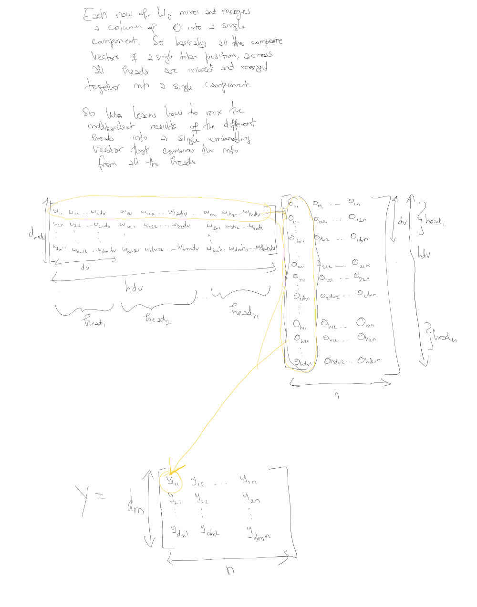

Of course this is a simplistic and flawed explanation, we'll have many transformer layers, and the initial embedding vectors are intiailized randomly, etc. But I think this explanation helps build intuition about the process.

Let's take our example sentence from earlier: "The animal didn't cross the street because it was too tired."

Lets assume that the word "it" is a token represented by some embedding vector `x_i`. 
Before attention, this embedding vector could encode the following semantic information: 
- "third person pronoun usually referring to an object, can be used as a verb or object".

After applying the multi-head self attention, `x_i` is transformed into an embedding vector `y_i` that encodes the information like:
- "refers to the animal"
- "subject of 'was'"
- "associated with tired"

So `W_Q`, `W_K` and `W_V` learn different spaces in which different notions of similarity and information are useful. `W_O` learns how to fuse the different heads' outputs.

#### Causal Masking

We should prevent the model from attending from future tokens in the sequence. For example, if we have the sequence `t_1` to `t_n` and we want
to predict the next token for the prefix `t_1`, ... `t_i` (where `i` < `n`), then the model must not attend to tokens `t_i+1`... `t_n`. Otherwise,
information about the identity of the true token will leak into the attention parameters and trivialize the training, it's basically cheating.
At inference time we won't have the target token available in advance, we have to predict it solely from the prefix tokens. So to recreate these
conditions during training, we must prevent attention from seeing future tokens.

We can achieve this efficiently by applying a mask in the attention layer. Basically, for each token position we mask out all the token positions that come after it.

Since masking is applied at the attention layer, after `Q @ T/sqrt(dk)`, just before the `softmax` operation, I find it helpful to take
another look at the `Q @ T` matrix multiplication in the multi-headed setting. The key detail to remember is that we're performing
the `Q@T` matrix multiplication independently for each head, also softmax independently for each head, and masking independently
in each head (using the same matrix mask). So each head will compute `softmax(causal_mask(Q@T/sqrt(dk)))`. So we won't compute
`softmax` of an entire row of the full matrix `Q` such that the entire row sums to 1. Instead, we'll treat the full `Q` matrix
as collection of `h` inpdendent sub-matrices each of size `(n, dk)`, and treat `K` and `V` similarly.

So basically, we're treating `h` as another batch dimension.
So instead of looking at the matrix `Q` as `(b, n, h * dk)`, we can look at it at as
`(b, h, n, dk)` where b is the overall batch dimension (`b` input sequences), and `h` a sub-batch dimension that performs
h independent transformations over the same input sequence `x`.

So at the first step of attention, we have the full `Q -> (n, h * dk)` and full `K.T` `(h * dk, n)`, we get a result matrix
of size `(n, h * n)`. Internally, the matrix multiply are done in batches:  `Q -> (h, n, dk)`, `K.T -> (h, dk, n)`, and the
result in batches `(h, n, n)`. So the output is h batches of `(n, n)` matrices of unnormalized scores.

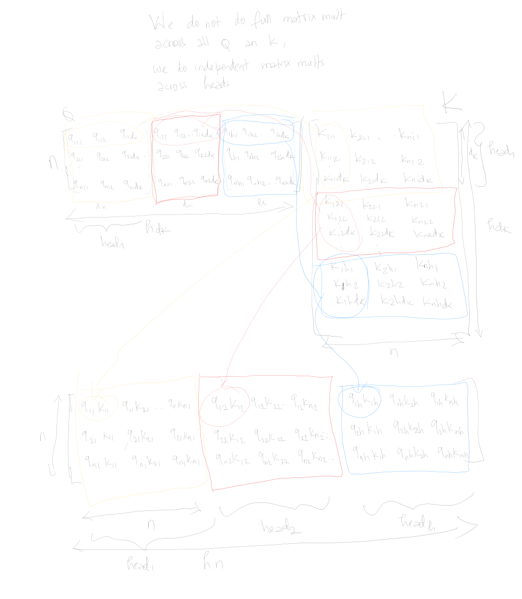

Now that we have h `(n, n)` matrices, remember that for each `(n, n)` matrix, each row i represents the unnormalize weigth of the relationship
between each token position and the token position i, and subsequently how strongly token position i should attend to each other token position.

Remember, in causal masking we don't want token `i` to attend to future tokens during training because we want to learn to predict token `i + 1`.
So for each row `i`, we want to mask out all the tokens `j > i` (i.t. `j = i + 1`, `j = i + 2`, etc.). This translates to a triangle matrix
of size `(n, n)` that we can broadcast to each head `h` (and also the same mask can be applied in each batch `b`).

For a `(3, 3)` matrix, the mask would look like:

```python
M = [
  True False False
  True True  False
  True True  True
]
```

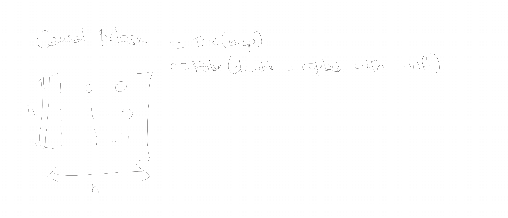

The following breakdown shows how the (n, n) triangular matrix mask is broadcoasted across the h heads, and applying
the mask per head before softmax is computed. The results are `h` `(n, n)` triangular weight matrices filled with
0's in the upper triangles to ensure token positions don't attend to future token positions in each head.

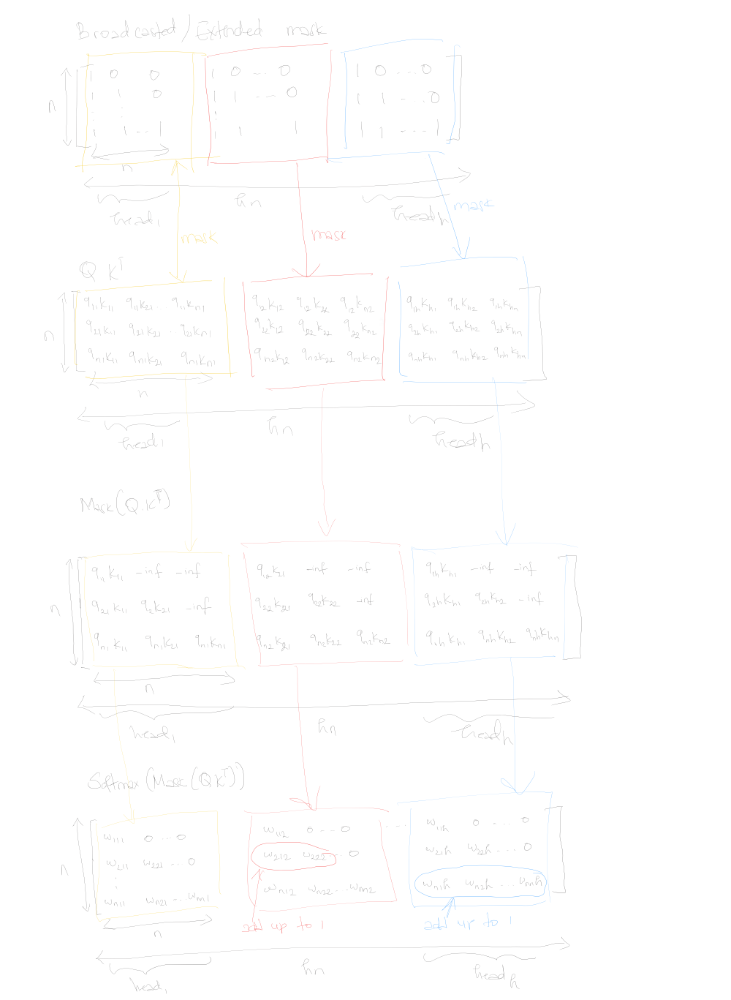

Finally, we take the resulting `h` `(n, n)` matrices and perform per-head matrix multiplications with the `h` `(n, d_v)`
value matrices to get the `h` `(n, d_v)` output of merged value matrices.

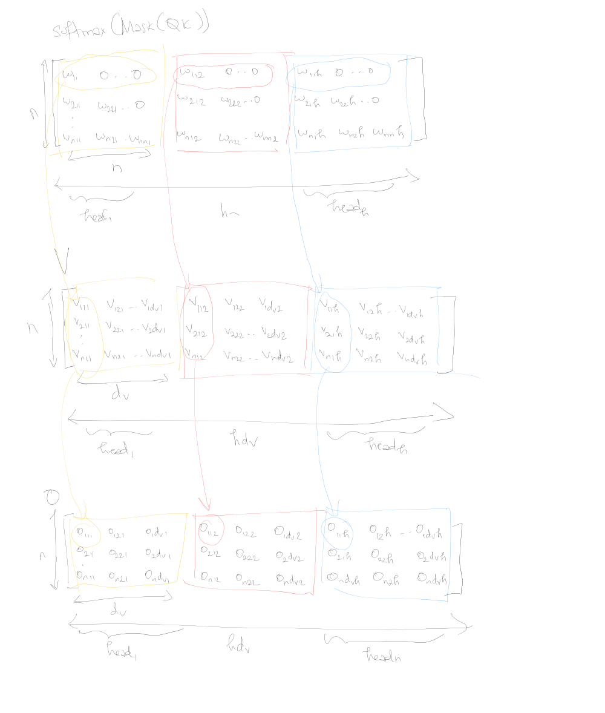

In the diagram above, it seems like I arranged the scores matrix and V matrix in a way that doesn't align, i.e. `(n, h * n)`
and `(n, h * dv)`. However, remember that the `h` dimension is batch dimension. We're not doing a full matrix multiplication
between the unnormalized scores and V, we're doing `h` independent matrix multiplications of `(n, n)` and `(n, d_v)` each.
So techically whether I draw the h dimensions across the vertical or horizontal axes is just for illustration only, it
doesn't affect which matrix is multiplied with which.

During implementation, we'll reshape the tensors such that the matrices to be multiplied are in the innermost dimensions, e.g. `(h, n, n)` and `(h, n, d_v)`. So a more accurate visual representation would be to have h across the vertical axis.

However, once we have the output matrix of "attention-aware" value vectors, we need to do a full matrix multiplication with `W_O`, and remember
that this transformation fuses the heads. So at this point we'll no longer treat `h` as batch dimension of independent heads, but
we'll treat `O` as a matrix of shape `(n, h * d_v)` (or `(h * d_v, n)`) and `W_O` as `(h * d_v, d_model)` to get final result matrix `(n, d_model)`

**Implementating casual multi-head self-attention**

I've implemented the causal multi-head self-attention in the module `MutliHeadSelfAttention` module in [`nn_modules.py`](./nn_modules.py).

This doesn't apply RoPE yet. So rope-related tests are expected to fail.

To test:

```sh
uv run pytest -k test_multihead_self_attention
```

```sh
======================================================================== test session starts ========================================================================
platform darwin -- Python 3.13.9, pytest-9.0.2, pluggy-1.6.0
rootdir: /Users/habbes/code/learn/stanford-cs336-llm-from-scratch/assignment1-basics
configfile: pyproject.toml
plugins: jaxtyping-0.3.9, timeout-2.4.0
collected 48 items / 46 deselected / 2 selected                                                                                                                     

tests/test_model.py::test_multihead_self_attention PASSED
tests/test_model.py::test_multihead_self_attention_with_rope FAILED
```

Note that I used 3 `Linear` weights matrices to compute the projections for `Q`, `K`, and `V`. This is aligns
with the instructions which say we should use a total of 3 matrix multiplications for this. But as a stretch
goal, we should combine them in a single matrix application. I'll revist this stretch goal after I got RoPE
working.

#### Applying RoPE

Before we apply RoPE to the MultiHeadSelfAttention block, let me take another step back to remember why
we use RoPE.

I found this video to be very helpful: [**How Rotary Position Embedding Supercharges Modern LLMs [RoPE]**](https://www.youtube.com/watch?v=SMBkImDWOyQ).

As discussed in the attention sections, for a given position `i`, we take the query vector at that position `q_i` and perform
a dot product with the key vector of every token position `j`, then perform softmax across the m weights and use these
weights to compute a weighted sum of the value vectors across all the token positions, which results in a merged
context-aware combined value vector corresponding to the query position.

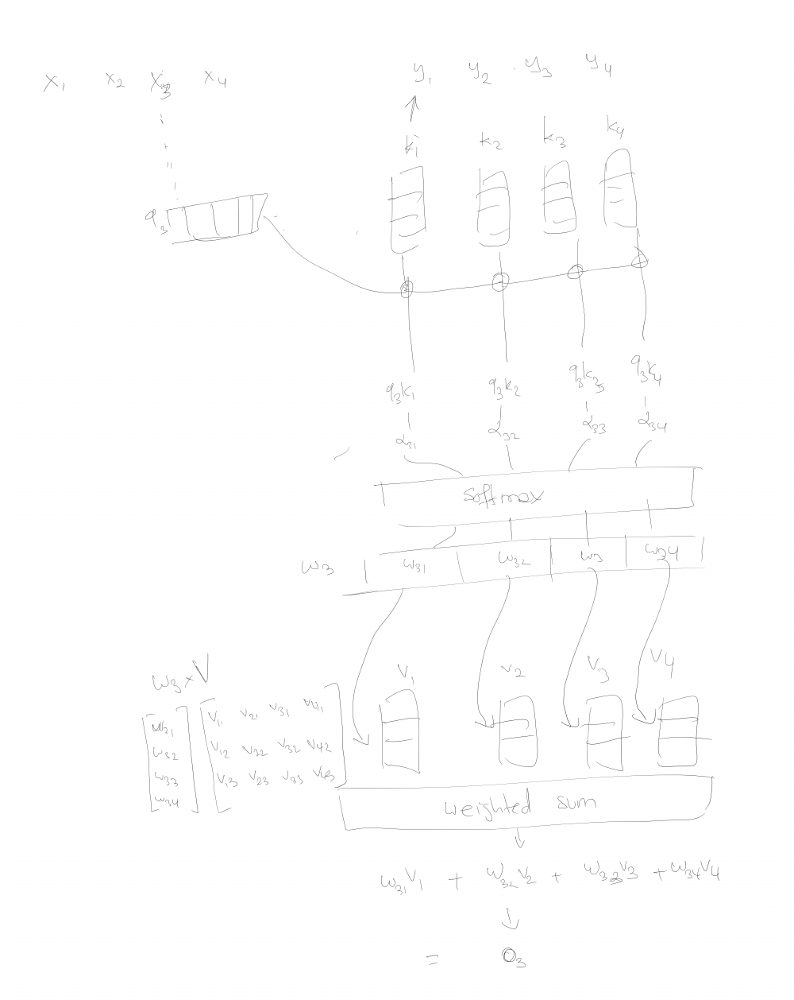

The important thing to notice here is that the dot product of the query and each key depends only on the contents of the vectors, not their positions.
And we know from the previous section that the query and key vectors are derived from the weight matrices `W_Q` and `W_K` and token emebeddings
in the input sequence. In a given training or inference pass, `W_Q` and `W_K` are fixed, since their values are only updated during backprop.
This means that given the same sentence or token sequence, we'll get the exact same exact query vectors, key vectors and value vectors. If the same
sentence or token sequence is shuffled such that the contents are in a different order, then we'll get the same queries, keys and values,
but also in a different order (1:1 mapping between tokens and query, keys, values). Where am I getting at: for each token, we'll get
the same output vector regardless of the position of the token in the sequence, since the attention mechanism so far depends only on the
content of the token and not the position.

Concretely speaking, let's say we have the sentence (consider each word a separate token):

A: I bought an apple watch

Here we can infer that apple refers to the tech company, based on the relationship between "apple" and "watch".

Now let's shuffle the sentence:

B: watch an apple I bought

In this sentence the query, key and value vectors associated with each token will be the same as in the previous sentence
even though the meaning has changed. `apple` and `watch` mean different things in sentences A and B, but the attention
mechanism will compute the same weights between the two tokens in both sentences.

This is the problem positional encoding tries to address. The absolute positional encoding used in the original
attention paper generates a unique sinusoidal vector for each token position, so the PE is a function of positions. Then
it's mixed with the input token embedding via vector addition. The problem with this approach is that encoding
is very noisy to shifts.

Let's take the following sentences:

A: I walk my dog every day

B: every day I walk my dog

They mean rougly the same thing, we kept the relative order of related words the same, but their exact positions
in the sequence has changed, which would lead to vastly different positional encodings since positional encodings are based
on absolute positions.

RoPE takes a different approach by applying positional encodings to the query and key vectors, not to the positions.
And the encodings are based on rotating the vectors based on an angle theta. Now the angle of rotation is based on the token
position. But it turns out that the effect of rotating a query vector based on its position i and key vector based on its position j
within the context of the attention computation, the aggregate effect is a rotation based on the difference between the angle at j and the angle at i.
Therefore, this is encoding the relative position or distance between tokens more directly rather than their exact positions in the sequence.

Remember that RoPE treats the vector q (and also k) as a collection of coordinate pairs in 2D space, i.e. a collection of `d_k/2` 2D points,
and then uses a 2D rotation matrix to rotate each point by an angle that's based on the token position as well as the component position in the vector
(lower components rotate at a higher frequency across positions and higher components rotate at a lower position across componets). But for simplicity,
we'll consider the query vector to only have two dimensions (`d_k` = 2), i.e. 1 2D point. And we can simplify RoPE as a single
rotation matrix that rotates by an angle based on the token position only (and constant `theta`)/

```python
R[i] = 
[
  cos(i * theta)  -sin(i * theta)
  sin(i * theta)   cos(i * theta)
]
```

Let's say
- `theta` = 5 degrees.

And in sentence A: "I walk my dog every day"
- `i` = 1 (I)
- `j` = 4 (dog)

So R rotates `q_i` by 1 * 5 = 5 degrees, and rotates `k_i` by 4 * 5 = 20 degrees.

Now let's say the sentence is reordered to B: "every day I walk my dog".
such that tokens at i and j are shifted 2 positions forward:

- Now the token "I" is at position `n` = 2 + `i` = 2 + 1 = 3
- "dog" is at position `m` = 4 + `j` = 2 + 4 = 6

Now R rotates `q_n` by 3 * 5 = 15 degrees and `k_m` by 6 * 5 = 30.

Notice that the relative differences in the angles is the same:
30 - 15 = 20 - 5 = 15 degrees.

Simple to see that if we shift i and j by s, the difference between the angles remains the same
as before the shift.

```
(j + s ) * theta - ((i + s) * theta)
= (j * theta + s * theta) - (i * theta + s * theta)
= j * theta + s * theta - i * theta - s * theta
= j * theta - i * theta + (s * theta - s * theta)
= (j * theta) - (i * theta)
```

Now we just need to show that if apply R[i] to q_i, and R[j] to k_j, and do the dot product
of the result, we also end up applying  R[j - i] (TODO: need to demonstrate this mathematically)