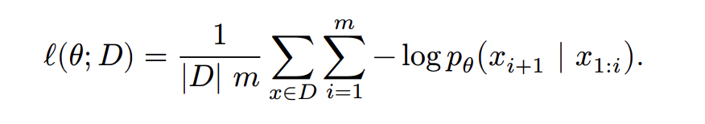

# 4. Training a Transformer LM

We now have the steps to preprocess the data (via tokenizer) and the model (Transformer). What 
remains is to build all of the code to support training. This consists of the following:

- **Loss**: we need to define the loss function (cross-entropy).
- **Optimizer**: we need to define the optimizer to minimize this loss (AdamW).
- **Training loop**: we need all the supporting infrastructure that loads data, saves checkpoints, and 
manages training.

## 4.1. Cross-entropy loss

I found the following videos by 3Blue1Brown timely in providing some intuitition behind entropy, cross-entropy
and why cross-entropy is used as loss function for language models:

- [Reinventing Entropy](https://www.youtube.com/watch?v=l6DKRf-fAAM)
- [But what is cross-entropy](https://www.youtube.com/watch?v=GlYgs6v2YfU)

The homework instruction defines the standard cross-entropy loss (negative log-likelihood) as follows:



But instead of me just copying and implementing it blindly, I want to see whether I can use intuition and what I learned
from the 3Blue1Brown videos above to derive the loss formula from first principles.

Note that in some cases I may give hand-wavy, somewhat watered-down, explanations based on intuition.
Remember to consult the 3Blue1Brown videos and/or other sources for more rigorous and satisfying
explanations.

**Recap of Information Content, Entropy and Cross-Entropy**

Let's say we can construct messages from a vocabulary of symbols, where the probability of a symbol
appearing in the message is defined by the probability distribution P, i.e. `P[i]` is the probability
of symbol `i`.

Intuitively, the higher the probability of a symbol, the less we are surprised to see it in a message, similarly
the lower the probability, the more we are surprised to see it. The occurrence of low-probability event
provides more information than a high probabilty event, which is expected and easier to predict.

Intuitively, if we were to encode a message in binary and we want to minimize bit length (i.e. optimize compression),
it makes more sense to allocate more bits to less likely symbols, and fewer bits to more likely symbols. Since
the higher-probability symbols will be more frequent in the message, we should minimize their respective binary encoding
to minimize the average message size. This will lead to more efficient encoding (in terms of bytes allocated) than giving
each symbol the same number of bits. Conceptually, this is similar to how in BPE tokenization algorithm, we merge
the most frequent pairs into single tokens.

Now let's get into the maths a bit. It can be demonstrated that to optimize the compression of messages produced with
symbols based on some distribution P, the number of bits to allocate each symbol `i` should be `-log2(P[i])`. This
is considered the **Information content** of the symbol. An encoding based on this will lead to optimal compression.

Note that `-log2(P[i])` is equivalent to `log1/2(P[i])`, the number of times you have to chop something by half to get the probability.
It is a positive number that increases as `P[i]` decreases and is 0 when `P[i] == 1` (i.e. a symbol that is certain, constant doesn't
require any bits, such a message does not need to be transmitted since it's value is always known and never changes, transmitting it
is inherently redundant as it provides no new information).

And from this we can derive the average number of bits per symbol in a message M that uses symbols with distribution P,
i.e. the average information content of a message. This is just a weighted average of the number of bits per symbol,
where the weights are determined by the probabilities of each symbol. This is also called the **Entropy** and is
defined as:

```python
H(P) = -sum(P[i] * log2(P[i]))
```

Based on this, we expect that a message M using symbols based on distribution P, and using an optimal binary encoding
for that distribution will use on average `-sum(P[i] * log2(P[i]))` bits per symbol when measure over a large enough
sequence of symbols.

Note that the entropy assumes optimal encoding, i.e. an encoding that is optimized for distribution P, where
each symbol `i` is allocated bitlength based on `-log2(P[i])`. But what if we the symbols are based on a different distribution
`Q` but encoded using an encoding optimized for distribution `P`? Well, in this case we can use the **Cross-Entropy** to measure
the average bits per symbol of a message using an encoding optimized for distribution P, but where the symbols are actually
based on distribution Q:

```python
H(Q, P) = -sum(Q[i] * log2(P[i]))
```

The formula is similar to entropy, expect we use probabilities `Q[i]` for the weights since that represent the true distribution of the symbols,
but we use `log2(P[i])` for the bits per symbol since the encoding is based on P.

Now remember that an encoding based on `P` is optimal compression (minimizes average bit length) if the distribution of the symbols is also based on `P`. For other distributions, it will be sub-optimal. This means that `H(Q, P) == H(P)` if `Q == P` and `H(Q, P) > H(P)` when `Q != P`. The entropy `H(P)`
is the lower bound for the cross-entropy `H(Q, P)`, and this lowerbound is achieved when the two distributions are similar.

This means that the cross-entropy gives us a way to measure how similar the two distributions are. If the distribution Q is idential to P, then the
cross-entropy is minimized and is equivalent to the entropy of a message based on P.

**Application to language modelling**

Remember that a language model is not just predicting the next token, but generating a probability distribution for the next token (i.e. generating a probability for each possible token that can come next).

The task of the language model is to generate `P(next token | prefix)` for each possible token given some prefix sequence of tokens.
During training, we measure how well the generated probability distribution matches the underlying probability distribution of the training
dataset. And with a sufficiently large and well curated dataset, we want the distribution of the dataset is a good enough approximation
of the distribution of the language.

During training we want to use a loss function that is minimized when the model's output distribution matches the distribution of the training data,
and penalizes divergent distributions.

Now let's break it down to the level of training examples. During training we collect snippets from the training corpus where each
snippet is broken down into a prefix and target word/token. Let's take the following example of possible snippets that happen
to have the same prefix:

- I'm happy today
- I'm happy because
- I'm happy today
- I'm happy but
- I'm happy because
- I'm happy today
- I'm happy sometimes

If these are all occurrences of te prefix "I'm happy" in the training text, then the statistical distribution Q of the next
token based on the training data would be:

`P(next token| "I'm happy")` = [ Q_today: 0.43, Q_because: 0.29, Q_but: 0.14, Q_sometimes: 0.14]`.

Let's say the model outputs probability distribution P over the next token. For each example,
we use a loss function `f(x)` based on the output probability of the target token. The loss function
should penalize low probabilities of the expected target token (high loss) and reward high
probability of the target token.

So for the example `I'm happy -> today', we'll apply the loss function to the output probabilit P_today,
i.e. `f(P_today)`.

To get the average loss over all the training examples, we'll use a weighted average where the weight
of each loss will be based on the statistical probability of the target token in the training data:

```python
AverageLoss = sum(Q[i] * f(P[i]))
```

So what would be an appropriate loss function? Well for each example we want the loss to be minimized
when the probability of the target token is high (1), and the loss to be high when the output probability
of the target token is low. In addition, we want to average loss of all examples to be minimized
when the the output distribution of the target tokens matches the statistical distribution of the target tokens.
Specifically, the average loss should be minimized when the values of `P[i]` match the values of `Q[i]`.
We have already seen that the **cross-entropy** of P relative to Q matches this property, so cross-entropy
would be a good candidate for the average loss.

We can turn the formula above into cross-entropy by simply making the per-example loss function the negative log: `f(P[i]) == -log2(P[i])`.
As a result the average loss becomes the cross-entropy

```python
AverageLoss = sum(Q[i] * -log2(P[i])) = -sum(Q[i] * log2(P[i]))
```

Now there are many other possible per-example loss functions that have a similar shape as negative log (e.g. high when target probability is low, low
when target probability is high). The 2nd 3Blue1Brown video goes into more detail about why using a logarithm-based function is the ideal
option, I didn't get in the fine mathematical details.

For a single training example, we can consider that Q[target_token] == 1, i.e. in the snippet "I am happy today". Q(today | I am happy) is 1,
since that is the target token for that example, every other possible next token has prob 0.
So if only have a single example, the cross-entropy would be `-sum(Q[i] * log2(P[i]))`, since all `Q[i]` are 0 expect for `Q[target]`, most
terms will be eliminate leaving only `-Q[target] * log2(P[target])` = `- 1 * log2(P[target])` = `-log2(P[target])`. This is another
way to see how we can get from cross-entropy to the loss function.

Note that in deep learning we normally use `ln` (natural logarithm) instead of `log2` for the cross-entropy formula since `ln` is more
convenient to work with during gradient descent (since `d/dx ln(x) = 1/x`).

**Deriving training loss**

Now we know we'll use cross-entropy loss, we also know the per-example loss is `-log(P[target_token])`. Now we need to
apply this to the actual training process.

We'll be training one batch of data at a time. Each batch will have `B` sequences of `context_length` tokens.

I single sequence of size `m` will produce `m-1` training examples, e.g.

The sequence "I am happy today" will produce the following examples (assuming each word is a separate token):

Prefix | Target
-------|---------
I | am
I am | happy
I am happy | today

So for a sequence `x` of size `m + 1`, we'll produce `m` training examples.

In each example, the prefix is the range `x[1:i]` (inclusive) and the target is `x[i + 1]`, where
`i` goes from 1 to `m`.

The model will produce probability the distribution `P(V[k] | x[1:i])` where `x[1:i]` is the sequence of tokens from 1 to i (inclusive).
`V` is the vocabulary vector and `k` goes from 1 to `vocab_size`.

The loss function for this specific example is is based probability assigned to the target token `x[i + 1]`.

So the loss for the example is 

```python
LossForSingleExample =  -log(P(x[i + 1] | x[1:i]))
```

Now the average loss for all `m` training examples in the source sequence `x` will be:

```python
AverageLossForExamplesInSequence(x) = (1/m) * sum(-log(P(x[i + 1] | x[1:i])) for i in range(m))
```

Since we'll be training for each sequence in the training set, we need to get the average loss
over the entire data set (or in this case the batch, since we're doing mini batch gradient descent).
So we'll just aggregate the average of the loss above by the size of the dataset or batch:

```python
AverageLoss = (1/len(dataset)) * sum(AverageLossForExamplesInSequence(x) for x in dataset)
```

```python
AverageLoss = (1/len(dataset)) * sum((1/m) * sum(-log(P(x[i + 1] | x[1:i])) for i in range(m)) for x in dataset)
```

We can extract that `1/m` constant factor out of the outer summation to get:

```python
AverageLoss = (1/len(dataset)) * (1/m) * sum(sum(-log(P(x[i + 1] | x[1:i])) for i in range(m)) for x in dataset)
```

And this is equivalent to the original loss function formula in the instructions


Now remember that the transformer architecture we implement outputs unnormalized logits in the final
layer. The output layer has dimension `context_length * vocab_size` (i.e. output vector of vocab size for each of the context-length sequences),
assigning an unnormalized weight to each possible
token in the vocabulary. We turn these unnormalized weights in a probablity distribution using `softmax`:

```python
P[x[i + 1] | x[1:i]] = softmax(O[i])[x[i + 1]] = (e**O[i][x[i + 1]]) / sum(e**O[i][j] for j in range(vocab_size))
```

Where `O[i]` is the output vocab-sized vector correspoding to the training sequence `x[1:i]`, whose target output is the token `x[i + 1]

### 4.1.a Implementing cross-entropy loss

Implementing the cross-entropy loss requires some care with numerical issues, just like in the case of 
`softmax`.

> **Deliverable**: Write a function to compute the cross-entropy loss, which takes in predicted logits `o[i]`
> and targets `x[i + 1]` and computes the cross-entropy `l[i] = -log * softmax(o[i])[x[i + 1]]`.
> Your function should handle the following:
>
> - Subtract the largest element for numerical stability
> - Cancel out `log` and `exp` whenever possible
> - Handle any additional batch dimensions and return the average loss across the batch. As with section 3.2 we assume batch-like dimensions always come first, before the vocabulary size dimension.
>
> Implement`adapters.run_cross_entropy`, then run `uv run pytest -k test_cross_entropy` to 
> test your implementation.

Based on the hints above, we can transform the `-log * softmax(o[i])[x[i + 1]]` for better numerical stability, avoid over and underflows.

Here's the expanded version of the formula:

```python
exps = exp(o[i])
l[i] = -log * ((exps[x[i + 1]]) / sum(exps[j] for j in range(vocab_size)))
```

First, like in softmax, we can subtract the largest values (review `softmax` implementation to see why this works):

```python
exps = exp(o[i] - max(o[i]))
l[i] = -log * ((exps[x[i + 1]]) / sum(exps[j] for j in range(vocab_size)))
```

Now, remember the logarithmic identity `log(a / b) = log(a) - log(b)`. We can use
this to transform the formula above to:

```python
l[i] = - (log(exps[x[i + 1]]) - log(sum(exps)))
# which turns to
l[i] = -log(exps[x[i + 1]]) + log(sum(exps)))
```

Since `log(e**x) == x`, we can cancel out the `log` and `exp` in the first term. We can't
really simplify the second term though since it's a log of sums (and not a log of products).

```python
l[i] = -x[i + 1] + log(sum(exps))
```
